# Lab01

## Environment

Everything below was run on my own machine, so here is a quick reference so any command in
this report can be reproduced exactly.

| | |
|---|---|
| Shell | `zsh` (Labs 1-8 and 10), `bash` (Lab 9) |
| Working directory | `~/Documents/HCMUS/linux` = `/home/hung/Documents/HCMUS/linux` |
| Log file | `lab01/access.log` = `/home/hung/Documents/HCMUS/linux/lab01/access.log` |
| Log details | 17,872,192 bytes (~17 MB), 100,000 lines, nginx "combined" format |
| Screenshots | `screenshots/` - the folder sitting next to this file |

I stay in `~/Documents/HCMUS/linux` and the log lives in the `lab01/` subfolder, so every
command below refers to it as the **relative** path `lab01/access.log`. One sample line:

```text
203.0.113.88 - - [22/May/2026:00:00:01 +0700] "GET /static/css/main.css HTTP/1.1" 200 16889 "-" "python-requests/2.31.0"
```

---
## Lab 1 - Map an unknown directory

> Navigation · tree.

Create a nested directory `~/lab01/{src,test,docs}/{img,raw}` in a single command.

```bash
mkdir -p ~/lab01/{src,test,docs}/{img,raw}
```

Explain: I use `mkdir -p` to create multi-level directories, it will automatically create all
parent directories if need to. Also, I use `{...}` for creating multiple directories at the same level.
For example, `{1,2}/{3,4}` will create 4 directories: `1/3`, `1/4`, `2/3` and `2/4`

Drop empty files into each leaf folder and verify with tree -L 3 (or find . -type f if tree isn't installed).

```bash
touch ~/lab01/{src,test,docs}/{img,raw}/{hello.txt,hi.txt}
tree ~/lab01
```

Explain: I use `touch` to create multiple files at the same time, `{}/{}` follows the same rule as `mkdir` above.

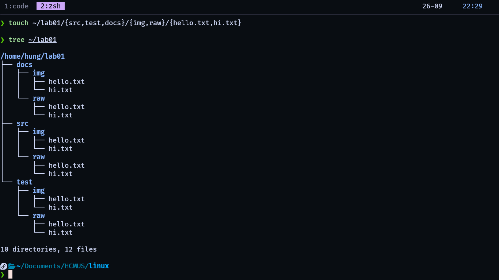

*`touch` then `tree ~/lab01` - 10 directories, 12 files.*

Count only the directories under `~/lab01` - not the files.

```bash
find ~/lab01 -type d  | wc -l
```

Explain: First, I list all the directories inside and including ~/lab01 itself via `find -type d`.
`-type d` means that the `type` is `directory`. Because the output of `find` would be lines of
path to distinct directories, I use pipe `|` to feed the output to `wc -l`, means **w**ord **c**ount
`-l` is lines so I can count how many lines there are. Since each directory is on a single line, count lines
will show me how many directories there are inside and including `~/lab01`.


Print the full path of every file using one command. 

```bash
find ~/lab01 -type f
```

I use `find` with `-type f` to find all files inside `~/lab01`, it will output all files.

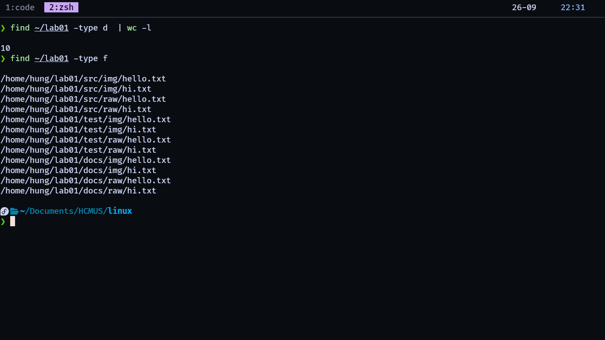

*`find ~/lab01 -type d | wc -l` gives 10, then `find ~/lab01 -type f` lists all 12 files by full path.*

---
## Lab 2 - Stdout vs stderr - split the streams

> Tight redirection drill.

### Task 1 - Redirect only stdout to `good.txt`, only stderr to `bad.txt`

```bash
ls /etc /nonexistent 1> good.txt 2> bad.txt
```

Explain: I use `1> good.txt` to redirect the stdout (1) to `good.txt` and `2> bad.txt` to redirect
errors to `bad.txt` since errors do not appear in stdout

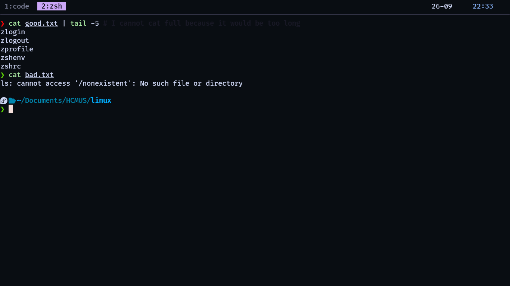

*`cat good.txt | tail -5` lists real files from `/etc`; `cat bad.txt` holds only the error line.*

### Task 2 - Combine both streams into one file `all.txt`

```bash
ls /etc /nonexistent > all.txt 2>&1
```

Explain:  I use `> all.txt` to redirect stdout(1) to `all.txt`, and `2>&1` means send file
descriptor 2 (stderr) to wherever file descriptor 1 (stdout) is currently going,
which is a file named `all.txt`.

So order matters, `cmd >f 2>&1` will redirect descriptor 2 (stderr) to  what descriptor 1 is currently going,
which is `f`. Comparing to `cmd 2>&1 >f`, we first, redirect stderr `2>&1` to what stdout is currently going,
which is still stdout, so we just make stderr to go to console, then we use `>f` to redirect stdout to
a file `f`, now the stdout is redirected to the file, but the stderr is still at the console.

### Task 3 - Discard stderr, keep stdout on screen

```bash
ls /etc /nonexistent 2> /dev/null
```

Explain: I just use redirect stderr to /dev/null, which will not store/show it anywhere.

### Task 4 - `tee` sends `uptime` to a file AND the screen

```bash
uptime | tee file.txt
```

Explain: `uptime` sends its stdout to `tee`'s stdin. `tee` then writes that input both 
to its `stdout` and to `file.txt`.

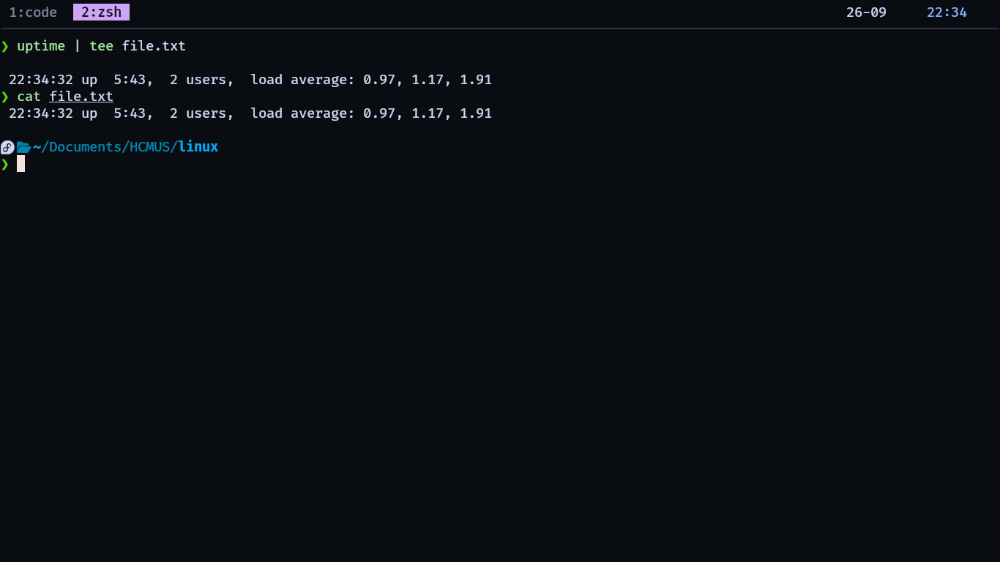

*`uptime | tee file.txt` prints on screen, and `cat file.txt` shows the identical line in the file.*


---
## Lab 3 - Find every TODO in a codebase

> grep pattern-hunting.

### Task 1 - Clone a small repo (or use `/usr/include`); find every line with TODO / FIXME / XXX, case-insensitive, with filename, line number, and 1 line of context above

```bash
grep -B 1 -in \
    -e "TODO" -e "FIXME" -e "XXX" \
    $(find /usr/include -maxdepth 1 -type f)
```

Explain: I use `grep` with `-B 1` to add 1 line of context above, `-in` to add case insensitive and line number
and I use `-e "text"` to indicate the pattern, then I use `$(find /usr/include -maxdepth 1 -type f)` to make
it search for all files with maxdepth 1 (because maxdepth 2 or higher would make the output too long to read)
inside `/usr/include`, `$` means: use the result of this `find` command
as arguments for `grep`.

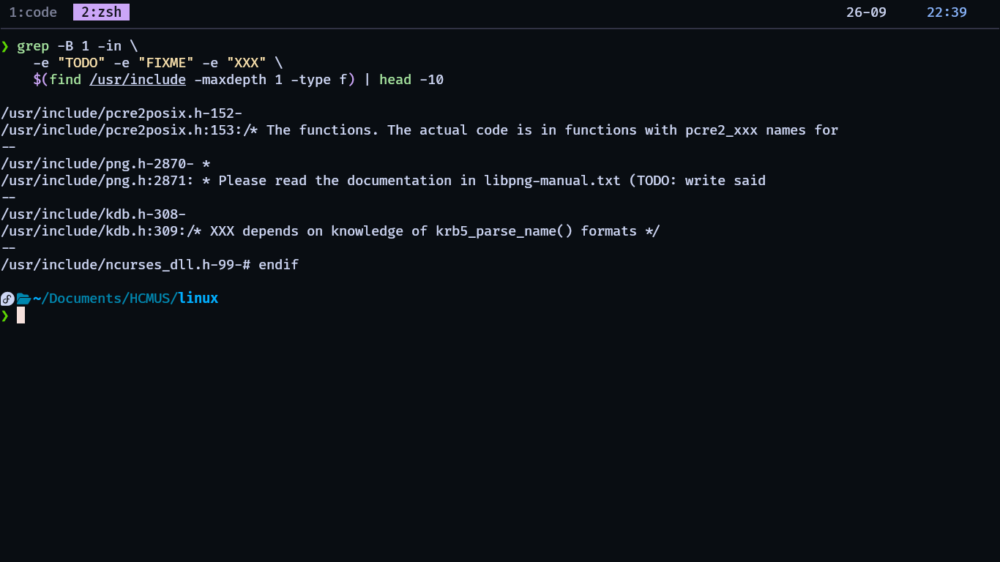

*Ten matches from `/usr/include` - the `-` separator lines are the 1 line of context from `-B 1`.*

### Task 2 - Exclude `node_modules/`, `.git/`, and binary files; then count how many distinct files contain a TODO

```bash
grep -lir --exclude-dir=.git --exclude-dir=node_modules \
    -e "TODO" \
    /usr/include | wc -l
```

Explain: I use `-r` for recursion, `exclude-dir=` to exclude directories, then use `-l` to output only distinct file.
Also, I pipe the grep output with `wc -l` to count lines as in lab 1 -> get how many files matched.


*`grep -lir ... | wc -l` returns 748 files.*

### Questions (in report)

- What repo/folder did you search, and roughly how many files?
I searched `/usr/include` (the system C headers). I limited it with `find -maxdepth 1 -type f`,
so about 226 files. The recursive search in Task 2 found TODO in 748 files.

- Pick one real TODO - what would you fix and why?
In `/usr/include/png.h:2871` (libpng) there is `TODO: write said documentation`.
I would write that documentation (or remove the TODO once it is done), because an API
without documentation is easy to misuse, and that causes bugs for everyone using libpng.

---
## Lab 4 - Top 10 IPs in access.log

> awk log analytics on `access.log`.
>
> **Where the log is:** I run every command in this lab from `~/Documents/HCMUS/linux`, and the
> file itself lives in the `lab01/` subfolder, so I always refer to it as the relative path
> `lab01/access.log` (absolute: `/home/hung/Documents/HCMUS/linux/lab01/access.log`, 100,000 lines).

### Task 1 - Top 10 IPs by request count (`awk` + `sort` + `uniq`)

```bash
awk '{print $1}' lab01/access.log | sort | uniq -c | sort -k1 -nr | head -10
```

Explain: I use `awk` to get the IP of all request, then `sort` it and count how many times each
individual IP appear via `uniq -c`. Then I sort the output descending by times the IP appears using `sort -k1 -nr`
means `sort` by column 1 (count/times) as number but reversed (descending) `-nr`. All piped to `head -10`
to get first 10 lines.

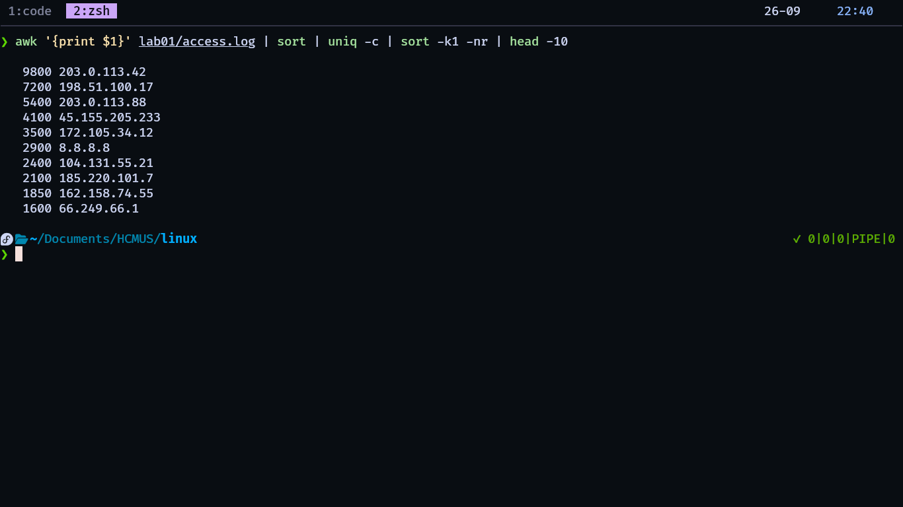

*`awk '{print $1}' lab01/access.log | sort | uniq -c | sort -k1 -nr | head -10` - 203.0.113.42 leads with 9800 requests.*

### Task 2 - Top 5 URLs that returned 404 - what were people hitting?

```bash
awk '$9 == 404 {print $7}' lab01/access.log | sort | uniq -c | sort -rn | head -5
```

Explain: I use `awk` to check that the status code (field `$9`) is exactly 404, then print the URL (field `$7`).
Checking with `$9 == 404` is more exact than grep "404", because grep would also match the number 404
inside other fields (like a byte size of 40428). Then I sort, count and rank like in Task 1,
and take the top 5 with `head -5`.

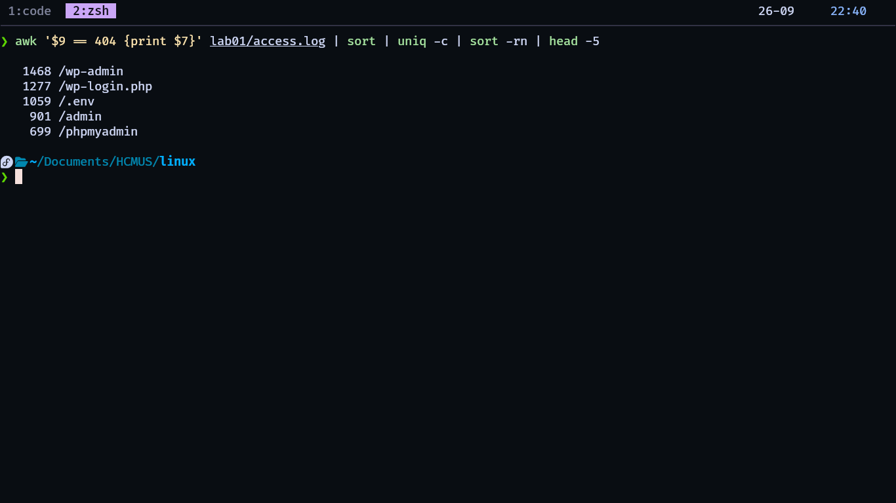

*`awk '$9 == 404 {print $7}' ... | head -5` - `/wp-admin` is the most-hit missing URL.*

### Stretch - sum total bytes served (field 10) with awk's `END` block

```bash
awk 'BEGIN {sum = 0}
    {sum += $10}
    END {print sum}' \
    lab01/access.log
```

Explain: It is like programming, i initialize variable `sum = 0`, then do a for loop-like each line using `awk`
each line, I do `sum += $10`, then after compute for the last line, I print the result.

### Questions (in report)

- What does the 404 list tell you about the traffic - real users or bots?
The top 404 targets are `/wp-admin`, `/wp-login.php`, `/.env`, `/admin` and `/phpmyadmin`.
Real users do not request things like `/.env` or `/phpmyadmin`, so this is bot traffic
scanning for WordPress sites, exposed config files and database admin panels.

---
## Lab 5 - Request-rate report by hour

> awk grouping & aggregation.
>
> Same `lab01/access.log` as Lab 4, same working directory - see the note at the top of Lab 4.

Hint: `split($4, a, ":")` breaks the timestamp - `a[2]` is the hour. `cnt[hour]++` does the grouping.

### Task 1 - Count requests per hour of day, output `HH count` sorted by hour

```bash
awk ' {
        split($4, a, ":");
        hour = a[2]
        arr[hour]++;
    }
    END {for(hour in arr)
            print hour " " arr[hour]
        }' \
            lab01/access.log \
            | sort -n -k1
```

Explain: I declare an (map) `arr` variable to store result, then for each line, i split to get hour
then increase `arr[hour]`, after that, I print the result by iterate through all keys of `arr`.
Finally, I print out the result with the right format.


*All 24 hours, sorted by hour - hour 19 is the busiest with 4370 requests.*

### Task 2 - Per HTTP status code: count and share of total traffic (1 decimal, %)

```bash
awk 'BEGIN {sum = 0}
    {
        code = $9;
        codes[code]++;
        sum++;
    }
    END {for (code in codes) printf "%s %d %.1f%%\n", code, codes[code], codes[code] * 100 / sum}'\
    lab01/access.log
```

Explain: I use `codes` to store all status codes and their count. Also, I use a variable called `sum` to store requests count for calculating the percentage.

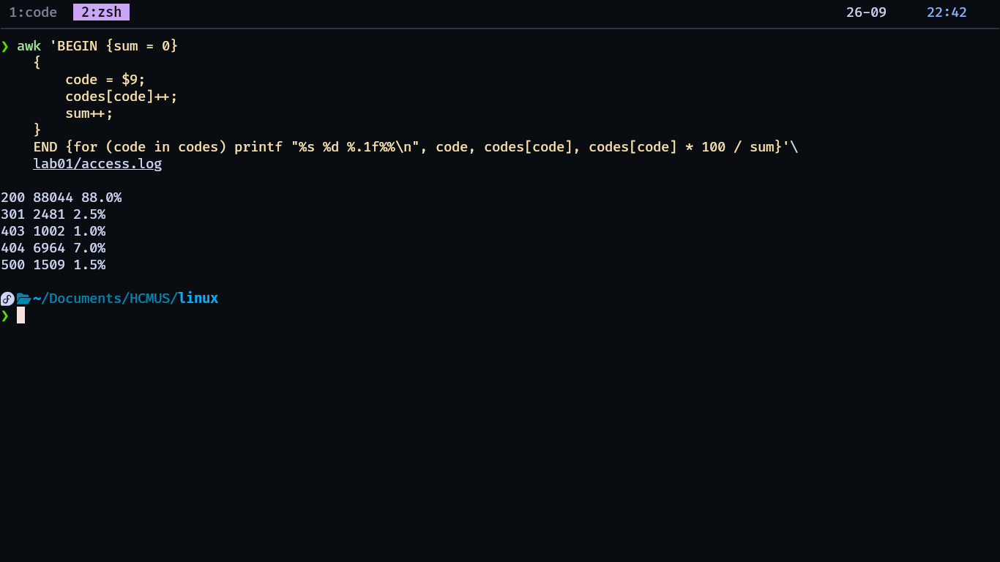

*`200` is 88.0% of traffic, `404` is 7.0% and `500` is only 1.5%.*

### Task 3 - The single hour with the highest 5xx error count

```bash
# Find all lines with 5XX status codes
awk '$9 >= 500 && $9 <= 599 {print}' lab01/access.log |
# count and find the highest count
awk '{
    split($4, a, ":");
    hour = a[2];
    arr[hour]++;
    }
    END {
        for (hour in arr)
            print hour, arr[hour]
    }' |
sort -nr -k2 | head -1
```

Explain: First, I use `awk` to filter all lines that have the `5XX` error code, then I piped the output to another
`awk`, then calculate the count for each hour. Finally I print the top 1 hour and counts of that hour.

### Stretch - average response size for `200 OK` responses only

```bash
awk '$9 == 200 {sum += $10; line_count++}
    END {if (line_count == 0){ line_count = 1;}
        printf "%.2f\n", sum / line_count}' \
    lab01/access.log
```

Explain: I choose all line that has 200 as a response code, then I calculate the file size sum, and number of lines.
Finally, I print out the result.

### Questions (in report)

- What was the peak hour, and what was the worst-5xx hour? Are they the same? What would that mean?
The peak hour which received most requests was hour 19 with 4370 request (based on Task 1).
But the hour which has most 5XX response was hour 10, not the same as peak hour.
So we can conclude that the traffic volume didn't cause the failures, maybe there are other problems.

---
## Lab 6 - Bulk-replace strings in config files

> sed · find · xargs.

Watch out: `sed -i` edits in place - no undo. Test on one file, or use `-i.bak`.

### Task 1 - Create 5 `.conf` files under `~/lab06/configs/` each containing `db_host=old-server.local`

```bash
mkdir -p ~/lab06/configs

tee ~/lab06/configs/file{1..5}.conf <<'EOF'
db_host=old-server.local
EOF
```

Explain: I create the required directory with mkdir -p. Then I use tee to write the same content to five files at the same time. <<'EOF' tells the shell to use the following lines as input until it reaches EOF.

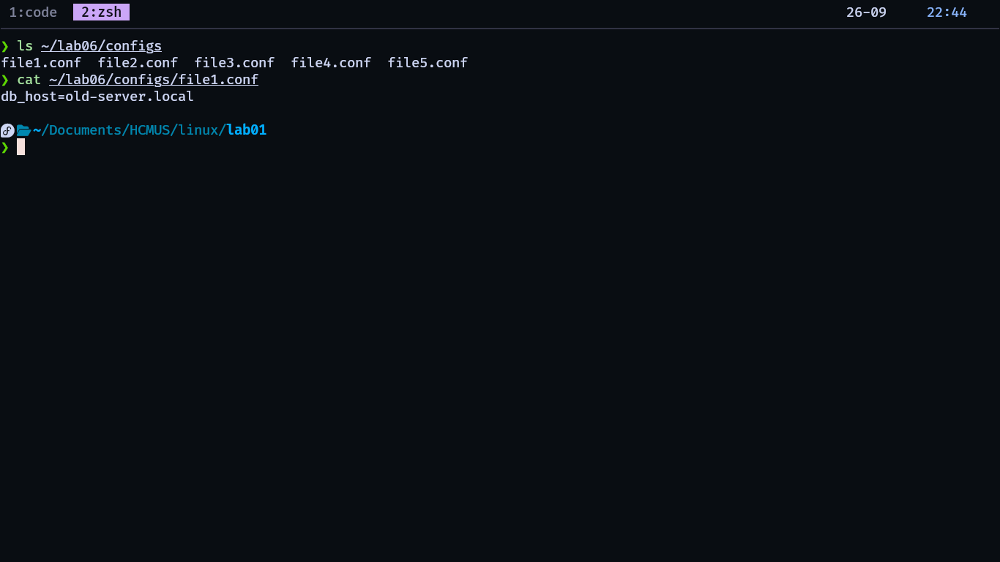

*`ls ~/lab06/configs` lists `file1.conf` ... `file5.conf`, and `cat file1.conf` still shows `db_host=old-server.local`.*

### Task 2 - Replace every `old-server.local` with `10.5.0.2` via a single `find … | xargs sed -i` pipeline

```bash
find ~/lab06 -type f -print0 | xargs -0 sed -i 's/old-server\.local/10.5.0.2/'
```

Explain: I use `find` to find all config files, then pipe to `xargs` to make them as arguments of `sed`.
Then I use `s/old-server\.local/10.5.0.2/` to substitute all `old-server.local` with `10.5.0.2`.
The `\.` escapes the dot, so sed matches a literal dot instead of "any character".

### Task 3 - Verify all files changed without opening them - use `grep -r`

```bash
grep -r -e "old-server.local" ~/lab06
```

Explain: After the replacement, no file should contain `old-server.local` anymore, so this `grep -r`
prints nothing - and empty output means every file was changed. If I search for `10.5.0.2` instead,
I can see the new value in all 5 files.

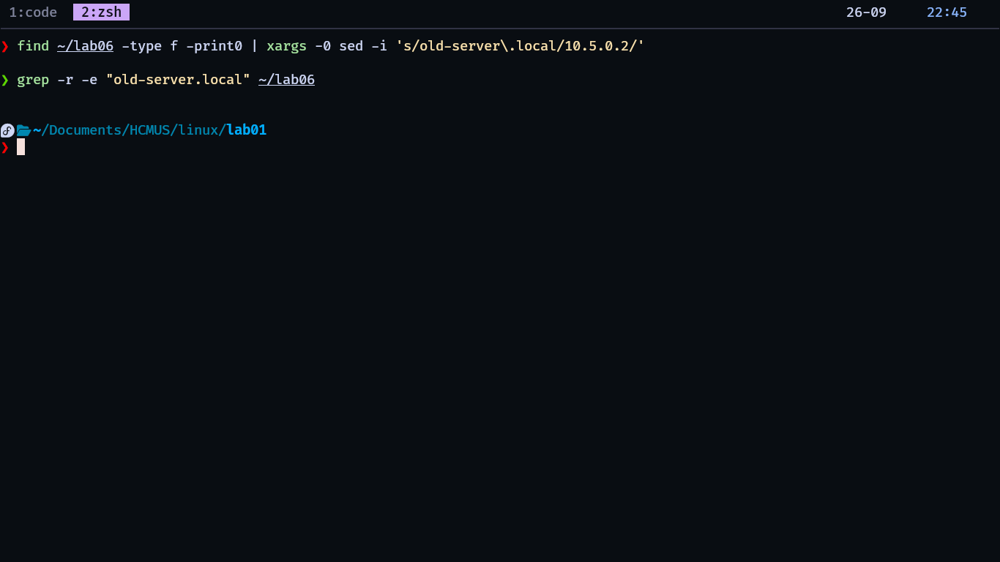

*The `grep -r` for `old-server.local` prints nothing at all - that empty output is the proof all 5 files changed.*

### Stretch - before replacing, back each file up to `*.conf.bak` using `sed -i.bak`

```bash
find ~/lab06 -type f -print0 | xargs -0 sed -i.bak 's/old-server.local/10.5.0.2/'
```

Explain: I add  `-i.bak` to make sure `sed` creates a backup before modifying anything.

### Questions (in report)

- Why use `xargs` instead of a shell `for` loop?

A `for` loop runs the command once for each item, while `xargs` can batch many items into fewer command executions, making it faster and more efficient for large amounts of input.

- When does `xargs` break

Plain xargs can break when filenames contain spaces, tabs, or newlines, because it treats whitespace as separators. Use xargs -0 with find -print0 for safe filename handling.

---
## Lab 7 - Disk-hog hunt & permission audit

> find · permissions · size.

Hint: `find ~ -type f -printf '%s %p\n'` prints size + path → `sort -rn` → `head`. Use `numfmt --to=iec` for human-readable sizes.

### Task 1 - The 10 largest files under your home, sorted by size, human-readable

```bash
find ~ -type f -printf '%s %p\n' | sort -nr -k1 | numfmt --to=iec | head -10
```

Explain: I find all file then print the size and path. Then I sort them descending by first column (size).
Finally I pipe them to `numfmt` to make the size human-readable and pipe to head to get first 10.

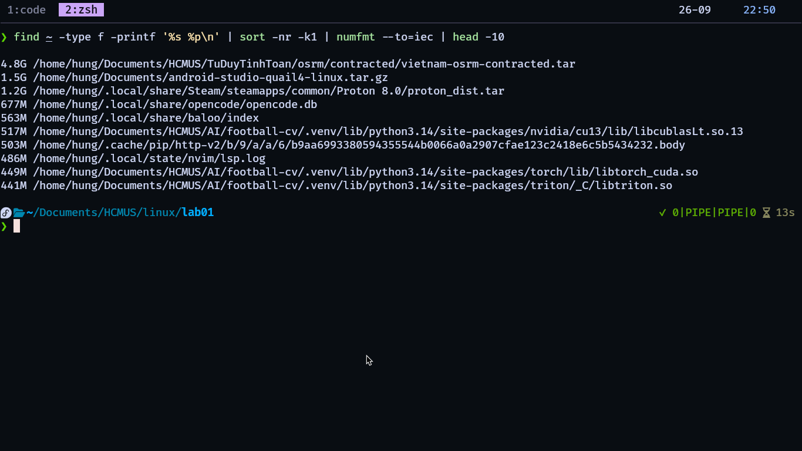

*`find ~ -type f -printf '%s %p\n' | sort -nr -k1 | numfmt --to=iec | head -10` - a 4.8G OSM extract on top.*

### Task 2 - Every file modified in the last 24 hours under `~/lab06`

```bash
find ~/lab06 -type f -mtime -1
```

Explain: I use `-mtime -1` to find all files that are modified under 24 hours from now.

### Task 3 - Every world-writable file under `/tmp` (`-perm -o+w`) - look, don't change

```bash
sudo find /tmp -type f -perm -o+w
```

Explain: `-perm -o+w` keeps files where the "other" (`o`) write bit is set, meaning any user on the
system can modify them. `-type f` only looks at regular files. On my machine this found nothing,
so /tmp was clean.


*`sudo find /tmp -type f -perm -o+w` - no output, so nothing under /tmp is world-writable.*

### Stretch - empty files AND empty directories in your home, listed separately

```bash
find ~ -type f -empty  # empty files
find ~ -type d -empty  # empty dirs
```

Explain: I use `-empty` instead of `-size 0`, because an empty directory is not size 0 - a directory
always takes some space for its metadata (like 40 bytes on ext4), so `-size 0` would miss it.
I run two separate commands with `-type f` and `-type d` to list empty files and empty dirs separately.

### Questions (in report)

- Why is a world-writable file potentially dangerous? Give one realistic attack scenario.
A world-writable file is potentially dangerous because any user or local process on the system
can modify, overwrite, or delete its contents.

Example: Assume that we have a file called `backup.sh` that the system would execute every time before an upgrade.
But `backup.sh` is a world-writable file so that a person or process can easily change what is inside `backup.sh`.
Then maybe next time `backup.sh` is executed, the system would break due to some malicious modification in `backup.sh`
by bad people.

---
## Lab 8 - Hard links, soft links, and the inode

> inodes & links.

The mental model: a file IS its inode. A directory name is a pointer to one. Hard links add pointers; symlinks are tiny files holding a path string.

### Task 1 - Create `original.txt`, plus one hard link and one symlink to it

```bash
touch original.txt
ln original.txt hard.txt
ln -s original.txt soft.txt
```

Explain: I create a hardlink using `ln`, symlink using `ln -s`

### Task 2 - Compare inodes with `ls -li` - hard link shares the inode, the symlink doesn't

```bash
ls -li
```

Explain: Shown in image of `ls -li`, the inode number of `hard.txt` and `original.txt` are the same. But 
`soft.txt` has a different inode number.

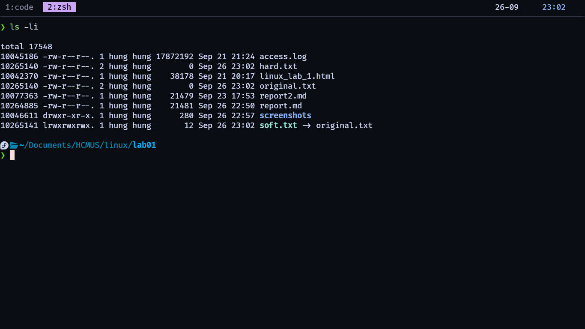

*`hard.txt` and `original.txt` are both inode `10265140` with link count 2; `soft.txt` is inode `10265141` and is flagged `-> original.txt`.*

### Task 3 - Delete the original - which link survives, and why?

```bash
rm original.txt
cat hard.txt   # still works
cat soft.txt   # becomes a broken link
```

Explain: When we delete `original.txt`, the hard link `hard.txt` still works, but the soft link `soft.txt` becomes broken.

The reason is that `original.txt` and hard.txt point to the same inode. Deleting original.txt only removes that filename; the inode and its data are still kept because hard.txt still points to the same inode.

A soft link is different. `soft.txt` has its own inode and stores the path to `original.txt`. When original.txt is deleted, that path no longer exists, so soft.txt becomes a broken link.

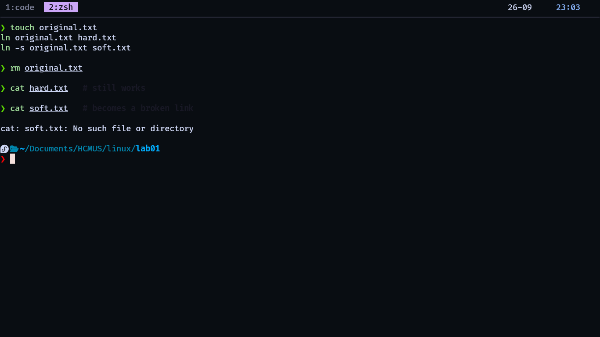

*After `rm original.txt`: `cat hard.txt` succeeds silently, while `cat soft.txt` reports "No such file or directory".*

### Stretch - symlink a file in another dir, then `mv` it to a third location

```bash
mkdir p1
touch p1/far.txt
ln -s p1/far.txt softfar.txt
```

```bash
mv p1/far.txt ./far.txt
cat softfar.txt # -> no such file or directory
```

Explain: A symbolic link stores a path. When the target file is moved, the path stored in the symbolic link doesn't change, so the link becomes broken.

---
## Lab 9 - Make your shell yours

> `.bashrc` productivity. Attach your `.bashrc` snippet.

### Task 1 - Add at least 5 useful aliases to `~/.bashrc`

```bash
alias nvimrc='cd ~/.config/nvim'
alias runcpp='g++ -std=c++23 -Wall -Werror *.cpp -o main && ./main'
alias l='ls -al'
alias li='ls -li'
alias ..='cd ..'
```

Explain: Aliases are shortcuts I put in `~/.bashrc`: `l` and `li` are short forms of `ls -al` and `ls -li`,
`..` goes up one directory, `nvimrc` jumps to my Neovim config, and `runcpp` compiles and runs my C++
files in one step. They only work in new shells or after running `source ~/.bashrc`.

### Task 2 - Write a `mkcd()` function that creates a dir and `cd`s into it

```bash
mkcd() {
    mkdir "$1" && cd "$1"
}
```

Explain: This is a function, not an alias, because it runs two commands in order and uses the argument (`$1`).
I quote `"$1"` so a folder name with spaces still works, and `&&` makes sure I only `cd`
if `mkdir` succeeded.

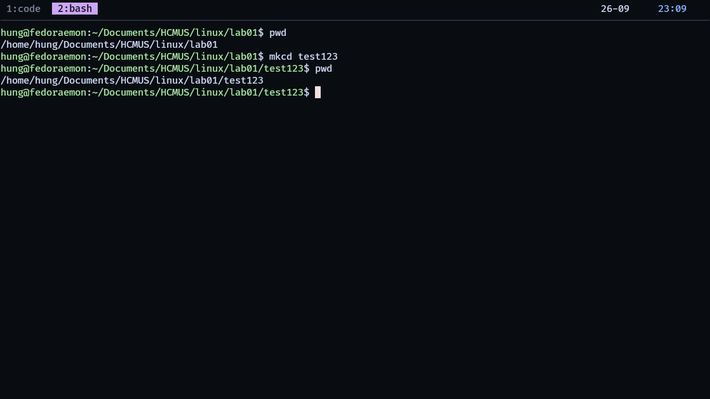

*`mkcd test123` then `pwd` - the prompt moves from `~/Documents/HCMUS/linux/lab01` to `.../lab01/test123`.*

### Task 3 - Set `HISTTIMEFORMAT` so `history` shows timestamps

```bash
HISTTIMEFORMAT="%Y-%m-%d %H:%M:%S || "
```

Explain: `HISTTIMEFORMAT` adds a timestamp to every line shown by `history`.
`%Y-%m-%d %H:%M:%S` gives a format like `2026-05-22 14:23:11`. I set it in `~/.bashrc`
so it applies to every new shell.

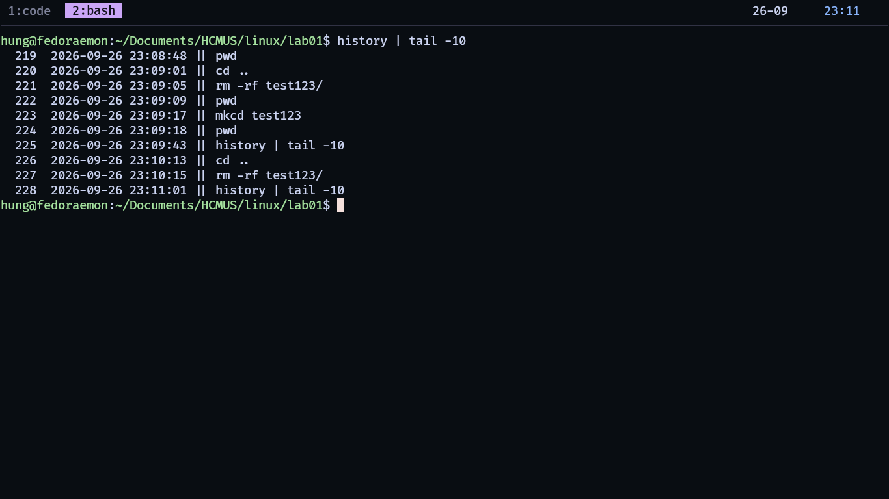

*`history | tail -10` - each line is prefixed with `2026-09-26 23:09:17 ||`.*

### Stretch - add an `extract()` function using a `case` on the filename extension

```bash
extract() {
    case "$1" in
        *.zip)
            unzip "$1"
            return 0
            ;;
        *.tar.gz)
            tar -xzf "$1"
            return 0
            ;;
        *.tar.bz2)
            tar -xjf "$1"
            return 0
            ;;
        *)
            echo "extract: Unsupported file type: $1" >&2
            return 1
            ;;
    esac
}
```

Explain: `extract()` uses a `case` statement to check the file extension and pick the right unpacking command:
`*.zip` runs `unzip`, `*.tar.gz` runs `tar -xzf`, `*.tar.bz2` runs `tar -xjf`.
If nothing matches, the `*)` case prints an error to stderr (`>&2`) and returns exit code 1.

---
## Lab 10 - The 3 AM pager - find the bad deploy

> Capstone · multi-tool, on `access.log` from Lab 4.
>
> Same `lab01/access.log` and same working directory as Lab 4 - see the note at the top of Lab 4.

This pulls every tool together. You're on-call: the Payment API is throwing 500s.

### Task 1 - Isolate every POST to any `/api/v1/payment*` URL that returned a 5xx, using only `grep · awk · sed · sort · uniq` (one pipeline, no scripts/temp files)

```bash
grep -e "POST /api/v1/payment" lab01/access.log |
awk '$9 >= 500 && $9 <= 599 {print}'
```

Explain: I filter in two steps: first `grep` keeps only the lines with `POST /api/v1/payment`,
then `awk` keeps only those whose status code (field `$9`) is between 500 and 599.
This gave 31 failing requests.

### Task 2 - From those failures, list unique client IPs, in order of who failed the most

```bash
grep -e "POST /api/v1/payment" lab01/access.log |
awk '$9 >= 500 && $9 <= 599 {print $1}' | sort | uniq -c | sort -rn -k1
```

Explain: I use the same 31 failures from Task 1, but now `awk '{print $1}'` extracts the client IP.
Then the usual `sort | uniq -c | sort -rn -k1` counts each IP and ranks them from most to least failures.

### Task 3 - What hour did the failures cluster in? Bucket by hour with awk

```bash
grep -e "POST /api/v1/payment" lab01/access.log |
awk '$9 >= 500 && $9 <= 599 {print}' |
awk ' {
        split($4, a, ":");
        hour = a[2]
        arr[hour]++;
    }
    END {for(hour in arr)
            print hour " " arr[hour]
        }' |
sort -nr -k2
```

Explain: `split($4, a, ":")` takes the hour from the timestamp (`a[2]`), and `arr[hour]++` counts the
failures per hour. The failures do not really cluster - the worst hour (23) only has 4.
That rules out a big burst at one moment and points to a slow, steady problem.

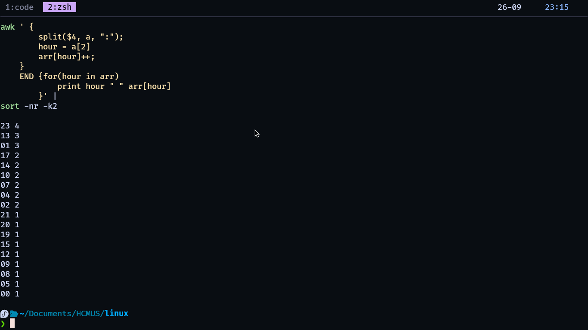

*The hour-bucket, worst first - hour 23 has 4 failures, hour 13 and 01 have 3 each, the rest 2 or 1.*

### Task 4 - One-liner (pipeline only) outputting `IP <tab> failure_count <tab> first_seen <tab> last_seen` for the top 5 IPs

```bash
grep -e "POST /api/v1/payment" lab01/access.log |
awk '$9 >= 500 && $9 <= 599 {print}' |
awk '{
    time = substr($4, 2)
    if (!($1 in first_seen)) {
        first_seen[$1] = time
    }
    last_seen[$1] = time
    count[$1]++
}
END {
    for (key in first_seen) {
        printf "%-15s\t%-8d\t%-25s\t%s\n", key, count[key], first_seen[key], last_seen[key]
    }
}' | sort -nr -k2 | head -5
```

Explain: This awk remembers 3 things per IP: `first_seen` (set the first time the IP appears),
`last_seen` (updated every time) and `count`. This only works because `access.log` is sorted by time.
`printf` puts a tab (`\t`) between the columns, and `sort -nr -k2 | head -5` keeps the top 5 IPs
by failure count.

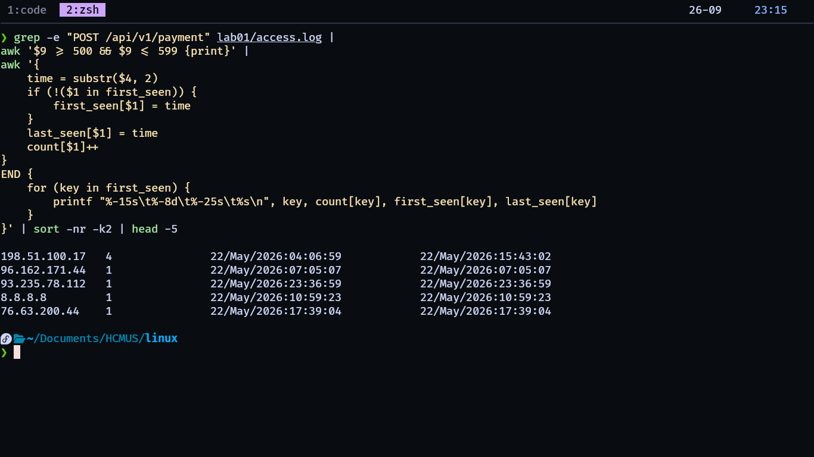

*The one-liner's table - 198.51.100.17 has 4 failures between 04:06:59 and 15:43:02; every other IP has exactly 1.*

### Questions (in report)

- Write-up: 5–10 sentences - what you found and what you'd do next (rollback? rate limit? page the backend team?). What did the data rule out?

I found 31 POST requests to /api/v1/payment* that returned a 500 error. All of them are plain 500 errors, no 502 or 503. The top offender is IP 198.51.100.17, with 4 failures in about 11 hours, using a python-requests user agent. The errors do not cluster - the worst hour only has 4, so a load spike is ruled out. The peak traffic hour (19) also had zero payment errors, so volume did not cause this. It looks like one flaky client or bot retrying the same payment path, or maybe an edge case in the API. Next I would rate-limit that IP and check the backend logs for the same window. I would also verify the endpoint is idempotent, and only roll back if a deploy landed before 04:06.
