# Lab02

## Environment

Everything below was run on a throwaway VM, so here is a quick reference so any command
in this report can be reproduced exactly.

| | |
|---|---|
| Platform | Debian GNU/Linux 13 (trixie), amd64, KVM guest |
| Shell | `bash` - SSH in as `lab`, then `sudo -i` for root |
| Working directory | `/root` (after `sudo -i`) — except Lab 3, which ran as `lab` in `/home/lab` |
| Report file | `labs/lab02/report.md` |
| Screenshots | `labs/lab02/screenshots/` - the folder sitting next to this file |

---
## Lab 1 - Populate a fresh server with users and groups

> useradd · groupadd · /etc/passwd · /etc/group — Warm-up

### Task 1 - Create groups `dev` and `ops` with `groupadd`. Verify both appear in `/etc/group`.

```bash
#input
groupadd dev
groupadd ops
cat /etc/group | tail -2

# output
dev:x:1001:
ops:x:1002:
```

Explain: I use `groupadd` to create 2 groups, then `cat /etc/group | tail -2` to show the group 
in `/etc/group`

`groupadd` took the two lowest free GIDs, so `dev=1001` and `ops=1002`. That is why the four
per-user groups created afterwards (`alice`, `bob`, `carol`, `dave`) start at `1003` — visible in
Task 2 and Task 3.

### Task 2 - Create users **alice** and **bob** with home directories (`-m`), bash shell (`-s /bin/bash`), a GECOS comment (`-c "Dev User"`), and add them to the `dev` group (`-G dev`).

```bash
#input
useradd -m -s /bin/bash -c "Dev User" -G dev alice
useradd -m -s /bin/bash -c "Dev User" -G dev bob
cat /etc/passwd | tail -2

#output
alice:x:1001:1003:Dev User:/home/alice:/bin/bash
bob:x:1002:1004:Dev User:/home/bob:/bin/bash
```

Explain: I use `useradd` to add 2 users

### Task 3 - Create users **carol** and **dave** the same way, added to the `ops` group. Set a password for each user with `passwd`.

```bash
#input
useradd -m -s /bin/bash -c "Ops User" -G ops carol
useradd -m -s /bin/bash -c "Ops User" -G ops dave

passwd carol # password is "1"
passwd dave # password is "1"

cat /etc/passwd | tail -2


#output
carol:x:1003:1005:Ops User:/home/carol:/bin/bash
dave:x:1004:1006:Ops User:/home/dave:/bin/bash

```

Explain: I use `useradd` to add 2 users, then use `passwd` to change/add password for `carol` and `dave`. 

### Task 4 - Run `id alice` and `id carol`. Identify the UID, primary GID, and supplementary groups in the output.

```bash
#input
id alice

# output
uid=1001(alice) gid=1003(alice) groups=1003(alice),1001(dev)

#input
id carol

# output
uid=1003(carol) gid=1005(carol) groups=1005(carol),1002(ops)

```

Explain: `alice` user id `uid` `1001`, **primary** group id `gid` `1003` (alice), 
group id (`groups`) `1003` (alice) and `1001` (dev)

`carol` user id `uid` `1003`, **primary** group id `gid` `1005` (carol), 
group id (`groups`) `1005` (carol) and `1002` (ops)

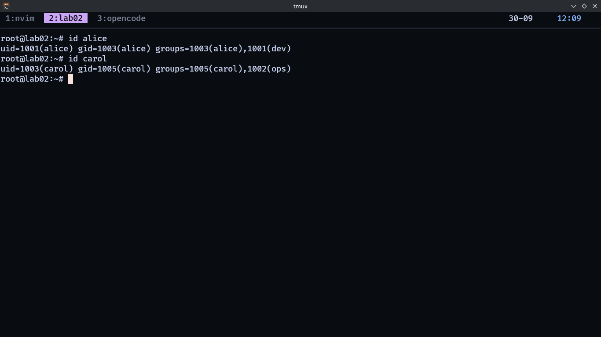

*id alice and id carol showing group memberships*

### Task 5 - Run `grep alice /etc/passwd`. Identify all 7 colon-separated fields and state what each one means.

```bash
# input
grep alice /etc/passwd
```

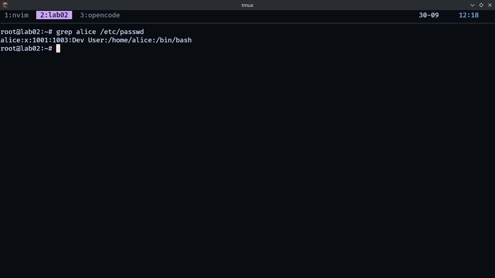

*grep of alice in /etc/passwd*

Explain:
    - `alice` is the username
    - `x` is a placeholder for password (put in `/etc/shadow`)
    - `1001` is `uid` which is user id.
    - `1003` is `gid` which is primary group id
    - `Dev User` is what we put after `-c` in `useradd` which is a short description for the user.
    - `/home/alice` is the home directory for the user `alice`
    - `/bin/bash` is default shell of `alice`

### Task 6 - Create a system user `svcapp` with no home dir and `nologin` shell: `useradd -r -s /usr/sbin/nologin svcapp`. What UID range does it receive? Why is this different?

```bash
# input
useradd -r -s /usr/sbin/nologin svcapp
id svcapp

# output
uid=999(svcapp) gid=989(svcapp) groups=989(svcapp)
```

Explain: 

- `svcapp` got UID `999`, which is inside the reserved system UID range, while `alice` got `1001`, inside the regular user range.

- `useradd -r` marks the account as a system account, so it allocates the ID from `SYS_UID_MIN`–`SYS_UID_MAX` (below `1000`, taken from the top down) instead of `UID_MIN`–`UID_MAX` (`1000`–`60000`, taken from the bottom up).

- UIDs under `1000` are reserved for the distribution and the daemons its packages create (`www-data`, `sshd`, …), which is why human accounts start at `1000` — that way a machine account can never collide with a person, and anything that has to tell accounts apart (`ls`, log analysis, password-aging policy) can just test `uid < 1000`.

- `-r` also skips home directory creation and password aging, since a service account never needs a home dir or a password that expires.


### Questions (in report)

- List all 7 fields of alice's `/etc/passwd` entry and explain each. Why does `svcapp` get a UID below 1000 while alice gets one above?

**Answer:** alice's entry is `alice:x:1001:1003:Dev User:/home/alice:/bin/bash`,
and the seven colon-separated fields are:

1. `alice` — the login name. This is what you type at a `su` or SSH prompt, and
   it is the key the rest of the system looks the account up by.
2. `x` — not the password. It is a placeholder; the real hash lives in
   `/etc/shadow`, which is mode `640` owned by `root:shadow`. That split is what
   lets `/etc/passwd` stay world-readable while the hashes stay private.
3. `1001` — the UID. Every file alice owns records this number rather than her
   name, and permission checks compare it.
4. `1003` — the primary GID, pointing at alice's own group `alice` in
   `/etc/group`. This is the group that owns any new file she creates unless she
   overrides it.
5. `Dev User` — the GECOS comment, the free-text field I passed with `-c`. It
   normally holds the real name, office, phone number. It is informational only
   and plays no part in authentication.
6. `/home/alice` — the home directory, i.e. the path `~` resolves to. It exists
   here only because I passed `-m`; `useradd` does not create it by default, and
   never does for a `-r` system account.
7. `/bin/bash` — the login shell, set with `-s /bin/bash`. This is the program
   the kernel runs after a successful login. `svcapp` has `/usr/sbin/nologin`
   here instead, which prints a refusal and exits, so nobody can get an
   interactive session as that account.

As for the UID split: alice is a *regular* user, so `useradd` took the next free
ID from `UID_MIN`-`UID_MAX` (1000-60000) in `/etc/login.defs`, which is why she
landed on 1001. `svcapp` was created with `-r`, which makes it a *system*
account, so its ID comes from the reserved range `SYS_UID_MIN`-`SYS_UID_MAX`
(everything below 1000) and is handed out from the top down, which is why it got
999. The sub-1000 block is reserved for the distribution itself: when a package
is installed its post-install scripts create daemon accounts such as `www-data`
or `sshd`, and those must never collide with a real person, so humans were given
their own range starting at 1000. The boundary doubles as a signal that a UID
under 1000 means "machine, not human" - which is precisely what makes it safe to
combine `-r` with `nologin`, no home directory, and no password aging for
`svcapp`.

---
## Lab 2 - The silent group-wipe trap

> usermod · -aG vs -G · lock/unlock · /etc/shadow — Warm-up

### Task 1 - Add alice to groups `dev`, `docker`, and `sudo` using `usermod -aG dev,docker,sudo alice`. Confirm all three appear in `id alice`.

```bash
# input
usermod -aG dev,docker,sudo alice
id alice

# output
uid=1001(alice) gid=1003(alice) groups=1003(alice),27(sudo),1001(dev),986(docker)
```

Explain: The user alice has been added to the supplementary groups dev, docker, and sudo. 
The user remains a member of the original primary group alice, which has not been changed.

Note: the screenshot for this step also shows `1007(qa)`, left over from an earlier run of this lab
before I reset the state. The three groups this task adds are `sudo`, `dev` and `docker`.

### Task 2 - **The trap:** run `usermod -G qa alice` (without `-a`). Run `id alice` again. What happened to dev, docker, and sudo?

```bash
# input
usermod -G qa alice

# output
uid=1001(alice) gid=1003(alice) groups=1003(alice),1007(qa)
```

Explain: Now alice is only in `alice` and `qa` groups.

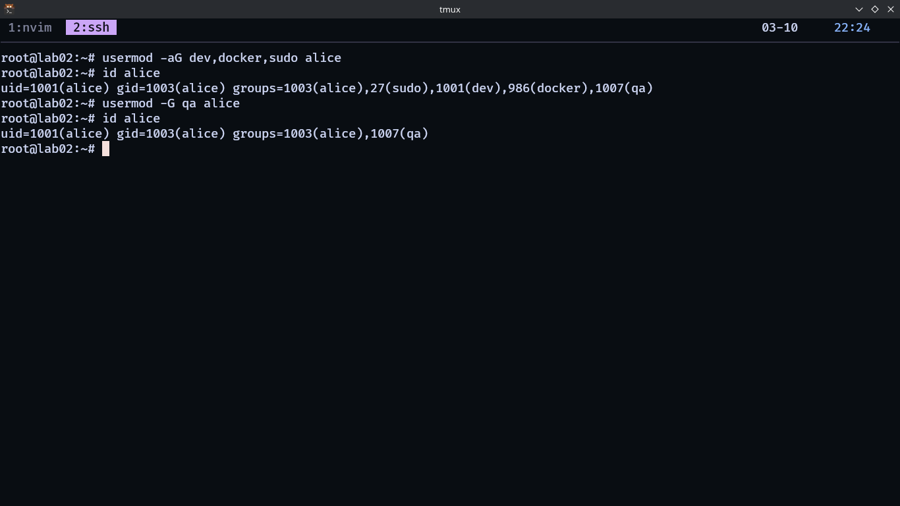

*id alice with 4 groups, then after the -G trap*

### Task 3 - Fix it: restore alice to all four groups (`dev`, `docker`, `sudo`, `qa`) in one command. Verify.

```bash
# input
usermod -aG dev,docker,sudo,qa alice
id alice

# output
uid=1001(alice) gid=1003(alice) groups=1003(alice),27(sudo),1001(dev),986(docker),1007(qa)
```

Explain: `alice` has been added again to 4 groups `sudo`, `dev`, `docker` and `qa`

### Task 4 - Run `su - alice` and then `groups` inside her shell. Do her active groups reflect the change yet? Run `newgrp dev` to activate without logging out.

```bash
# input
su - alice
groups

# output
alice sudo docker dev qa

# input
newgrp dev
id

# output
uid=1001(alice) gid=1001(dev) groups=1001(dev),27(sudo),986(docker),1003(alice),1007(qa)
```

Explain: Yes — her active groups already reflect the change, because `su - alice` starts a brand new
login session that re-reads the group list from `/etc/group`. A session that was already open *before*
the `usermod` would keep the stale list, and that is exactly the situation `newgrp` exists to fix.

`newgrp dev` starts yet another new shell, this time with `dev` as Alice's effective primary group
(GID 1001). Her other group memberships remain active. Newly created files will generally use `dev` as
their group ownership.

### Task 5 - Lock alice's account with `usermod -L alice`. Inspect `grep alice /etc/shadow` — what character appears before her password hash? Unlock with `usermod -U alice`.

```bash
usermod -L alice # lock
grep alice /etc/shadow

usermod -U alice # unlock
```
Explain: After using `usermod -L`, `grep` shows a '!' before `alice` password hash to represent that the 
account has been locked.

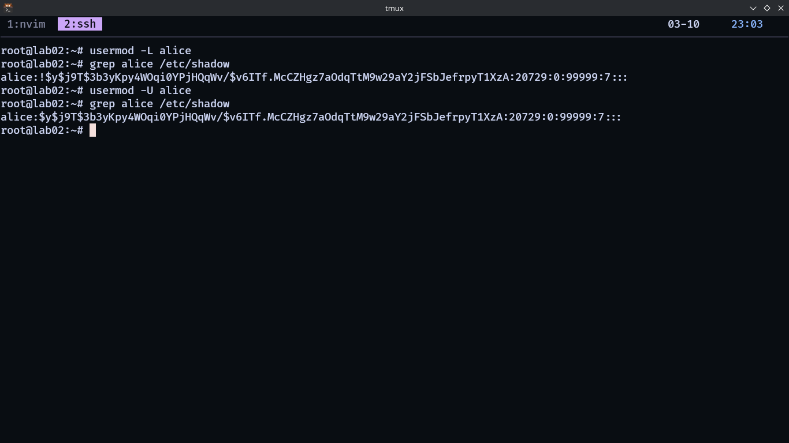

*/etc/shadow entry for alice, locked then unlocked*

### Questions (in report)

- Explain the difference between `-g` (lowercase), `-G`, and `-aG`. In what real-world scenario would silently losing sudo access cause a serious production outage?

Answer: In the `usermod` command:
- `-g` sets the user's primary group.
- `-G` sets the user's supplementary groups, replacing the existing supplementary group list.
- `-aG` adds the specified groups to the user's existing supplementary groups without removing the groups they already belong to.
One real world scenario is that when an administrator access to server with his account `a` which has sudo privilege 
by adding group `sudo` to `a`'s supplementary group. One day, the administator wants to test something with docker. 
He wants to add `docker` as another supplementary group for convenience of using `docker` command without `sudo`. 
But instead of using `aG` to add `docker` group, he used `G` to override groups of his user so that he lost his `sudo` privilege.

---
## Lab 3 - Read, write, execute — controlling file access

> chmod · chown · umask · permission evaluation — Warm-up

### Task 1 - Create `secret.txt` and directory `reports/`. Check their default permissions with `ls -la`. Note the permission string and the current umask.

```bash
# input
umask
touch secret.txt
mkdir reports
ls -al | grep -e "secret" -e "reports"

# output
drwxrwxr-x 2 lab  lab  4096 Oct  3 17:06 reports
-rw-rw-r-- 1 lab  lab     0 Oct  3 17:06 secret.txt
```

Explain: `reports/` permission string: `drwxrwxr-x` → directory permissions `775`
`secret.txt` permission string: `-rw-rw-r--` → file permissions `664`

The default umask is `002` (as printed by `umask`), because:
    - Directory: 777 & ~002 = 775
    - File: 666 & ~002 = 664


### Task 2 - Use **octal** chmod: set `secret.txt` → `600`, `reports/` → `750`. For each, write out what the three octal digits mean in rwx terms.

```bash
chmod 600 secret.txt
chmod 750 reports/
```

Explain:
    - 600 for `secret.txt` means: `-rw-------`
    - 750 for `reports/` means: `drwxr-x---`

### Task 3 - Use **symbolic** chmod on `reports/`: add execute for the owner, remove all permissions for others, set group to exactly `r-x`. Use a single command with a comma-separated list.

```bash
chmod o-rwx,u+x,g=rx reports/
```

Explain: `u+x` adds execute permission for the owner, `o-rwx` removes all permissions for others, 
and `g=rx` sets the group permissions to read and execute.

### Task 4 - Change the owner of `reports/` to `alice:dev` recursively with `chown -R`. Verify with `ls -la reports/`.

```bash
# might need to use sudo if we are not the root user

chown -R alice:dev reports
ls -al reports

# output
drwxr-x--- 3 alice dev 4096 Oct  3 17:26 .
drwx------ 4 lab   lab 4096 Oct  3 17:26 ..
drwxrwxr-x 2 alice dev 4096 Oct  3 17:26 directory1
-rw-rw-r-- 1 alice dev    0 Oct  3 17:26 file1
```

Explain: Change the owner of `reports/` to `alice:dev` recursively with `chown -R`. A files/directory inside owner changed too.

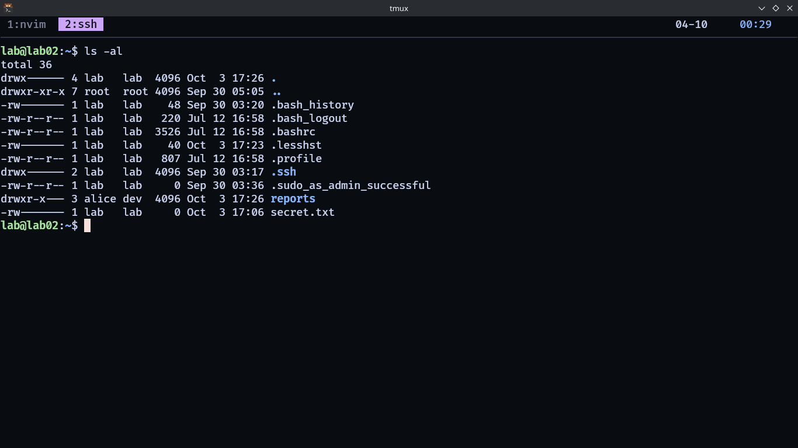

*ls -la with secret.txt at 600 and reports/ at 750, alice:dev*

### Task 5 - Change the umask to `027` and create a new file and directory. What permissions did they receive? Explain using the formula *base − umask*.

```bash
# input
umask 027
touch newfile.txt
mkdir newdirectory
ls -al | grep -e "newfile" -e "newdirectory"
```

Explain: With umask `027`, files start from `666` and directories from `777`. 
Therefore, `666 − 027 = 640` for `newfile.txt`, and `777 − 027 = 750` for `newdirectory`.

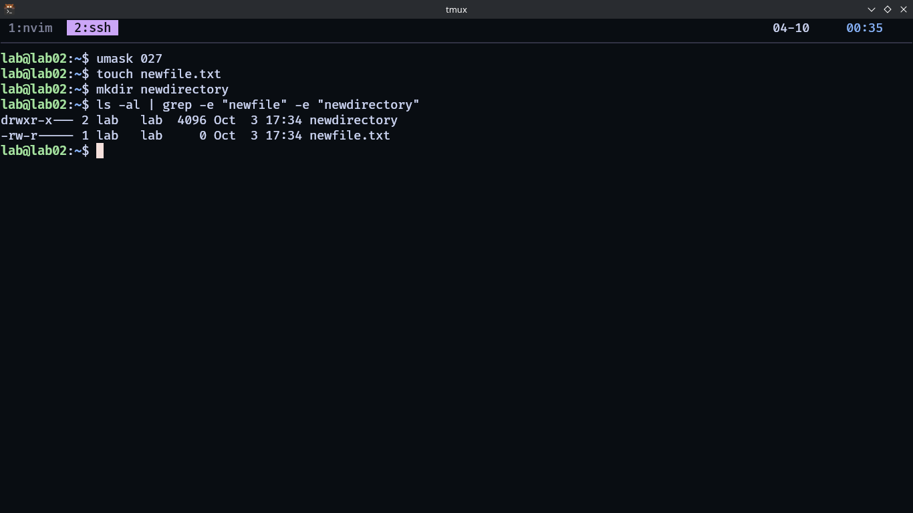

*umask 027 and the resulting permissions on a new file and directory*

### Task 6 - **Experiment:** create a file owned by alice with permissions `640`, group `dev`. Log in as bob (also in dev) and try to read it. Then log in as dave (in ops) and try to read it. Explain why each succeeded or failed.

```bash
touch alicefile.txt &&
chmod 640 alicefile.txt
chown alice:dev alicefile.txt

su bob
cat alicefile.txt # ok

su dave
cat alicefile.txt # -> cat: alicefile.txt: Permission denied
```

Explain: `alicefile.txt` has permissions `640`: the owner (`alice`) has `rw-`, the group (`dev`) has `r--`, and others have no permissions. Therefore, `bob` can read it because he belongs to `dev`, while `dave` cannot because he is in `ops` and has no permissions as an “other” user.

### Questions (in report)

- Walk through the permission evaluation for: (a) bob reading the 640 file, (b) dave reading it. Use the 4-step order from the slide to show your reasoning.

Answer:

(a) bob reading the 640 file:
1. bob is not root.
2. bob is not the owner (owner is alice).
3. bob is in the file's group (dev) → apply group bits: `r--`.
4. Read is allowed.

(b) dave reading the 640 file:
1. dave is not root.
2. dave is not the owner (owner is alice).
3. dave is not in the file's group (dev).
4. Apply other bits: `---` → read is denied.

---
## Lab 4 - Special permission bits: shared directories and elevated execution

> SUID · SGID · sticky bit · find -perm — Medium

### Task 1 - Create `/opt/teamshared`. Set owner to `root:dev`. Apply mode `3775` (SGID + sticky + rwxrwxr-x). Run `ls -ld /opt/teamshared` — identify the `s` and `t` characters in the output.

```bash
mkdir /opt/teamshared
chown -R root:dev /opt/teamshared/
chmod -R 3775 /opt/teamshared
ls -ld /opt/teamshared

```

Explain: `s` represents SGID, `t` represents sticky bit. SGID means that every file/directory that created under 
`/opt/teamshared` would have the group of `/opt/teamshared` which is `dev`. Sticky bit only only allow the user 
who created the file can delete that file.

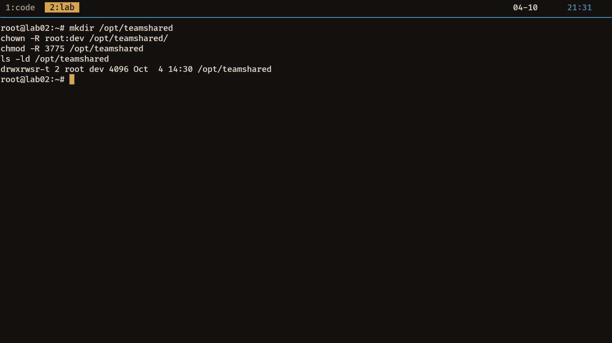

*ls -ld /opt/teamshared showing the s (SGID) and t (sticky) characters*

### Task 2 - As alice (`su - alice`), create a file inside `/opt/teamshared`. Log back out as root and check `ls -l /opt/teamshared`. What group owns alice's file and why?

```bash
su - alice
touch /opt/teamshared/alice.txt
sudo -i # log back as root
ls -l /opt/teamshared

# output
-rw-rw-r-- 1 alice dev 0 Oct  4 14:31 alice.txt
```

Explain: Instead of having group `alice`, `alice.txt` has `dev` group. This happens because of the SGID 
I talked about before which automatically sets files's group to be the same as it's directory group.

### Task 3 - **Test the sticky bit:** as bob, try to delete alice's file. Confirm it fails. Now remove the sticky bit from the directory (`chmod -t`) and try again. What changes?

```bash
su - bob
rm /opt/teamshared/alice.txt # rm: cannot remove '/opt/teamshared/alice.txt': Operation not permitted

sudo -i # change to root
chmod -t /opt/teamshared

su - bob
rm /opt/teamshared/alice.txt # ok
```

Explain: Before remove the sticky bit from `/opt/teamshared`, bob cannot delete `alice.txt` file 
which is created by alice. Because sticky bit only allows the creator of the file to delete it.

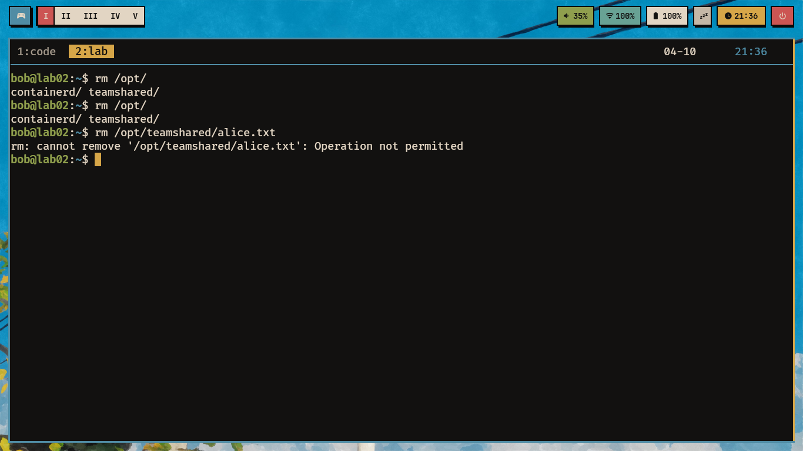

*bob's failed rm on alice's file (Operation not permitted)*

### Task 4 - Restore the sticky bit. Create a small script `/tmp/whotest.sh` containing `echo "Running as: $(whoami)"`. Set SUID on it (`chmod u+s`) and make it owned by root. Run it as alice. What identity does it report?

```bash
sudo -i # change to root
chmod +t /opt/teamshared

# as root
echo 'echo "Running as: $(whoami)"' > /tmp/whotest.sh

chown root:root /tmp/whotest.sh
chmod +x,u+s /tmp/whotest.sh

su alice
/tmp/whotest.sh

# output
Running as: alice

```

Explain: It reports `alice`, and the important part is *why* the SUID bit did not change that.

Two things are going on:

1. `alice` was never blocked from running the script. The file started at `644`, and
   `chmod +x,u+s` turned that into `4755` — so the "other" bits already gave her `r-x`.
   The SUID bit added nothing to her ability to execute it.
2. Even so, the script still ran as `alice`, because **Linux does not honour the setuid bit on
   scripts**. The setuid bit only takes effect when the kernel itself loads a binary image. A
   script is not a binary — the kernel has to hand the file to an interpreter (`/bin/sh` here,
   since the file has no `#!` line at all), and it is the interpreter that ends up executing,
   with the caller's privileges. Had this been a compiled binary, for example a root-owned copy
   of `/usr/bin/passwd`, `whoami` inside it would have printed `root`.

### Task 5 - Find all SUID binaries on the system: `find / -perm -4000 2>/dev/null`. Identify at least 3 you recognize and explain in your report why each one needs SUID.

```bash
find / -perm -4000 2>/dev/null
```

Explain:
    - `sudo`: SUID is needed so that a normal user can run sudo and have it perform privileged operations as root. sudo checks the user's permissions and, if allowed, executes the requested command with elevated privileges.
    - `passwd`: SUID is needed because passwd must modify protected password information that normal users cannot directly write. The program runs with root's effective privileges to update the user's password.
    - `su`: SUID is needed because su must switch to another user's identity, including root. A normal user does not normally have permission to perform the required privileged operations, so su runs with root's effective privileges.

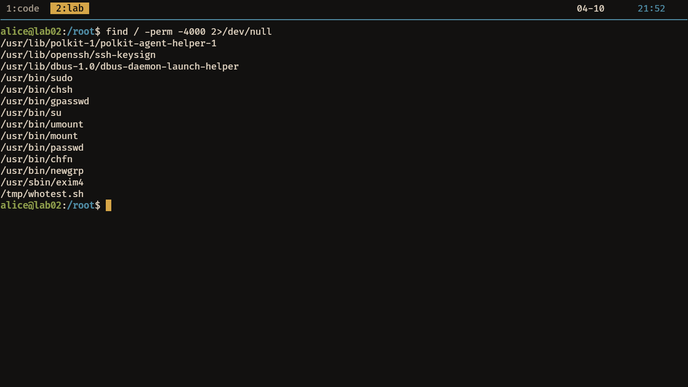

*output of the SUID binary search*

### Questions (in report)

- Why is SUID on `/bin/bash` a critical security vulnerability? What exact steps could an attacker take to exploit it and get a root shell?

Answer: If `/bin/bash` is owned by `root` and has SUID:

```text
normal:
alice → bash → runs as alice

SUID root:
alice → bash → runs with root privileges
```

Because Bash is a **general-purpose shell**, a root SUID Bash lets an unprivileged user run *any*
command as root. The exact steps an attacker would take:

```bash
# 1. copy the SUID-root shell somewhere they can write
cp /bin/bash /tmp/mybash

# 2. keep the root ownership and add/confirm the setuid bit
chown root:root /tmp/mybash
chmod u+s /tmp/mybash
ls -l /tmp/mybash          # -rwsr-xr-x 1 root root ...

# 3. run it with -p so bash does not drop privileges, and confirm euid is 0
/tmp/mybash -p
id -u                     # 0  <- effective UID is root

# 4. do anything, as root
/tmp/mybash -c 'id'
cat /etc/shadow            # readable now
```

Step 3 is the crucial one: bash normally discards elevated privileges when it is not the
*real* login shell, which is why a naive `mybash` attempt drops back to `alice`. `-p`
(`--privileged`) stops that reset, and the process keeps `euid=0`. From there every
subcommand in that shell is root — there is no allow-list to work around, because the program
being exploited *is* a full shell.

Therefore:

> **SUID should only be used on carefully designed programs that need limited privileged operations, not on general-purpose shells.**

---
## Lab 5 - Fine-grained access control with ACLs

> setfacl · getfacl · default ACL · mask — Medium

### Task 1 - Create user `charlie` (no special group). Create `/opt/project` owned by `root:dev`, mode `770`.

```bash
useradd charlie
mkdir /opt/project
chown root:dev /opt/project
chmod 770 /opt/project
```

Explain: Just do what the requirement says

### Task 2 - Apply ACLs: `g:dev:rwx`, `g:ops:r-x`, `u:charlie:r-x`. Run `getfacl /opt/project`. Also run `ls -la` and notice the trailing `+` character.

```bash
setfacl -m g:dev:rwx,g:ops:r-x,u:charlie:r-x /opt/project
getfacl /opt/project

# output
getfacl /opt/project
getfacl: Removing leading '/' from absolute path names
# file: opt/project
# owner: root
# group: dev
user::rwx
user:charlie:r-x
group::rwx
group:dev:rwx
group:ops:r-x
mask::rwx
other::---

ls -al /opt/project

#output
total 8
drwxrwx---+ 2 root dev  4096 Oct  4 15:04 .
drwxr-xr-x  5 root root 4096 Oct  4 15:04 ..
```

Explain: ACL allows us to give permissions to specific users and groups beyond the normal `owner/group/others` model.

    - `dev` → `rwx`
    - `ops` → `r-x`
    - `charlie` → `r-x`
    - `mask` → `rwx`, so these permissions are fully effective.
    - `+` in `ls -al` means `/opt/project` has an extended ACL.

### Task 3 - Set a **default ACL** so any new files or subdirectories created inside `/opt/project` inherit the same permissions: `setfacl -d -m g:dev:rwx,g:ops:r-x,u:charlie:r-x /opt/project`. As alice, create a file inside and run `getfacl` on it.

```bash
setfacl -d -m g:dev:rwx,g:ops:r-x,u:charlie:r-x /opt/project

# as alice
touch /opt/project/alice.txt
getfacl /opt/project/alice.txt
```

Explain: `alice.txt` inherits the default ACL set with `setfacl -d -m`, but **not** a verbatim copy
of it. When a file is created inside a directory that has a default ACL, every inherited entry is
intersected with the mode the kernel was actually asked for. `touch` requests `0666`, and a regular
file's mode never carries the execute bit, so every `x` in the inherited entries is dropped and the
mask shrinks to `rw-`:

```text
user::rw-
user:charlie:r--      # was r-x in the default ACL
group::rw-
group:dev:rw-         # was rwx
group:ops:r--         # was r-x
mask::rw-
other::---
```

That is why the `x` on a *directory* default ACL is meaningful but the same `x` on a file

### Task 4 - **The mask trap:** run `chmod g-x /opt/project`. Run `getfacl /opt/project` again. What happened to the *effective* permissions for `dev` and `charlie`? Why?

```bash
chmod g-x /opt/project
getfacl /opt/project

# output
getfacl: Removing leading '/' from absolute path names
# file: opt/project
# owner: root
# group: dev
user::rwx
user:charlie:r-x		#effective:r--
group::rwx			#effective:rw-
group:dev:rwx			#effective:rw-
group:ops:r-x			#effective:r--
mask::rw-
other::---
default:user::rwx
default:user:charlie:r-x
default:group::rwx
default:group:dev:rwx
default:group:ops:r-x
default:mask::rwx
default:other::---
```

Explain: `chmod g-x` changes the ACL **mask** from `rwx` to `rw-`. The ACL entries still request `x`, but the mask limits their effective permissions:

- `dev`: `rwx` → **effective `rw-`**
- `charlie`: `r-x` → **effective `r--`**
- `ops`: `r-x` → **effective `r--`**

The mask acts as the **maximum permission** for the ACL group-class.
Therefore, removing `x` from the directory's group permission also removes
`x` from the effective ACL permissions.

> The ACL entries are not deleted; the mask simply limits their effective permissions.

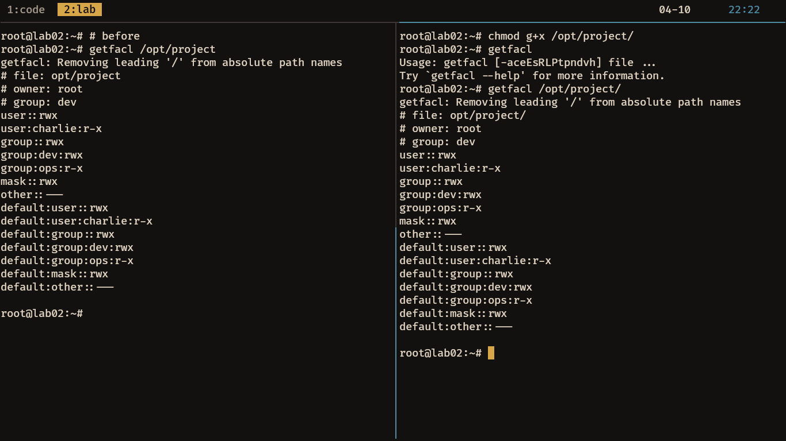

*getfacl before and after chmod g-x, showing the #effective comment*

### Task 5 - Restore the mask by running `chmod g+x /opt/project`. Then revoke charlie's ACL entirely with `setfacl -x u:charlie /opt/project`. Confirm with `getfacl`.

```bash
chmod g+x /opt/project
setfacl -x u:charlie /opt/project
getfacl /opt/project

# output
getfacl: Removing leading '/' from absolute path names
# file: opt/project
# owner: root
# group: dev
user::rwx
group::rwx
group:dev:rwx
group:ops:r-x
mask::rwx
other::---
default:user::rwx
default:user:charlie:r-x
default:group::rwx
default:group:dev:rwx
default:group:ops:r-x
default:mask::rwx
default:other::---
```

Explain:
    - `mask::rwx` is restored.
    - `user:charlie` is removed from the **access ACL**.
    - `default:user:charlie:r-x` remains because it belongs to the **default ACL**, which controls permissions inherited by newly created files/directories.

### Questions (in report)

- Explain what the ACL *mask* is and why running `chmod` on a file with ACLs can silently cut effective permissions. When should you use ACLs instead of standard chmod?

Answer: The **mask** is the ceiling on the whole "group class" of an ACL — that is, on
`group::`, every named `group:<name>:`, and every named `user:<name>:` entry. Each of those
entries still stores the permission it *asks* for, but the kernel grants only
`entry AND mask`, and `getfacl` prints the difference as `#effective:`. Because `chmod` on a
file with an ACL writes to the mask rather than to the individual entries (see the mask trap in
Task 4), a plain `chmod g-x` silently strips execute from every named user and group in one
move while leaving the ACL text looking untouched — nothing is deleted, only capped.

    - **`chmod`** → use for simple permissions: `owner / group / others`.
    - **ACL** → use when you need permissions for **specific users or groups**.

    Example:

    ```text
    chmod → dev group: rwx
    ACL   → alice: rwx, bob: r-x, ops: r--
    ```

    **Rule:** Simple → `chmod`. Fine-grained → ACL.

---
## Lab 6 - Grant surgical sudo access to a CI deploy user

> visudo · sudoers.d · NOPASSWD · least privilege — Medium

### Task 1 - Create user `deploy` as a system user with no home and `nologin` shell: `useradd -r -s /usr/sbin/nologin deploy`. Confirm you cannot get an interactive shell via `su - deploy`.

```bash
useradd -r -s /usr/sbin/nologin deploy &&
su - deploy
# su: warning: cannot change directory to /home/deploy: No such file or directory
# This account is currently not available.
```

Explain: Just do what requirement says

### Task 2 - Create the deploy script: `mkdir -p /opt/scripts`, then write `/opt/scripts/deploy.sh` with content `echo "Deploying application..."`. Set permissions `750` and owner `root:dev`.

```bash
mkdir -p /opt/scripts
echo 'echo "Deploying application..."' > /opt/scripts/deploy.sh
chmod 750 /opt/scripts/deploy.sh
chown root:dev /opt/scripts/deploy.sh
```

Explain: Just do what requirement says

### Task 3 - Open `visudo -f /etc/sudoers.d/deploy` and add a rule allowing the `deploy` user — without a password — to run only `/opt/scripts/deploy.sh` and `/bin/systemctl restart cron`.

```bash
visudo -f /etc/sudoers.d/deploy
```

Explain: This sudoers rule gives `deploy` permission to run only two commands as `root`, without entering a password:

    - `/opt/scripts/deploy.sh`
    - `/bin/systemctl restart cron`

    `NOPASSWD` means no password is required.

```bash
# /etc/sudoers.d/deploy
deploy ALL=(root) NOPASSWD: /opt/scripts/deploy.sh,/bin/systemctl restart cron
```

### Task 4 - **Test (allowed):** run `sudo -u deploy sudo /opt/scripts/deploy.sh` and `sudo -u deploy sudo /bin/systemctl restart cron` from your admin account. Both should succeed silently.

```bash
sudo -u deploy sudo /opt/scripts/deploy.sh
sudo -u deploy sudo /bin/systemctl restart cron

# output
Deploying application...
```

Explain: Both ran without asking for a password, which is what `NOPASSWD` buys — sudo did not
prompt for `deploy`'s password because the command is on the allow-list. The deploy script
printed its own `Deploying application...` line, so it was not literally silent; the
`systemctl restart cron` call produced no output at all, which is the normal result for a
successful restart.

### Task 5 - **Test (denied):** run `sudo -u deploy sudo /bin/bash` and `sudo -u deploy sudo rm /etc/passwd`. Both should be rejected with a "not allowed" message.

```bash
sudo -u deploy sudo /bin/bash
sudo -u deploy sudo rm /etc/passwd

# output
[sudo] password for deploy:
Sorry, user deploy is not allowed to execute '/bin/bash' as root on lab02.
[sudo] password for deploy:
Sorry, user deploy is not allowed to execute '/usr/bin/rm /etc/passwd' as root on lab02.
```

Explain: Neither command is in the sudoers rule, so both were rejected. Note the
`[sudo] password for deploy:` prompt first — `NOPASSWD` only covers the two commands named in
the rule, so for anything else sudo falls back to normal password authentication. `deploy` was
created with `-r` and never had a password set, so there was nothing to type and the attempt
died at the authorisation check. The second message also shows sudo resolved `rm` to its
absolute path `/usr/bin/rm`, which is why the rule has to name full paths.

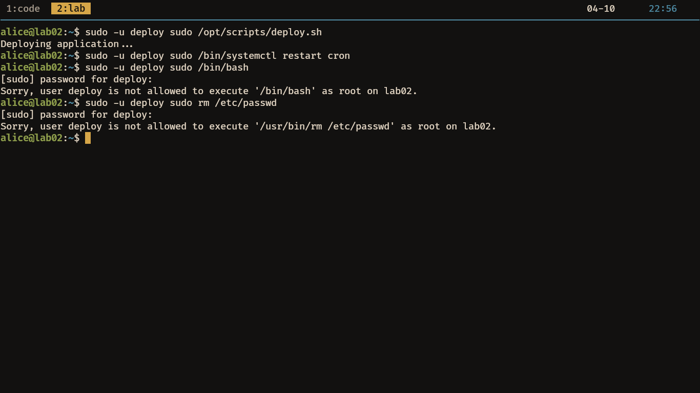

*the allowed command succeeding and the denied command being rejected*

### Task 6 - Check the audit trail: `grep "deploy" /var/log/auth.log | tail -20`. Find the COMMAND entries for both an allowed run and a denied attempt.

```bash
grep "deploy" /var/log/auth.log | tail -20
```

Explain: The audit log confirms both **allowed** and **denied** sudo actions.

- `COMMAND=/opt/scripts/deploy.sh` → allowed and executed as `root`.
- `COMMAND=/bin/systemctl restart cron` → allowed and executed as `root`.
- `command not allowed ... COMMAND=/bin/bash` → denied.
- `command not allowed ... COMMAND=/usr/bin/rm /etc/passwd` → denied.

This demonstrates that the `deploy` account has only the privileges explicitly
granted by the sudoers rule.

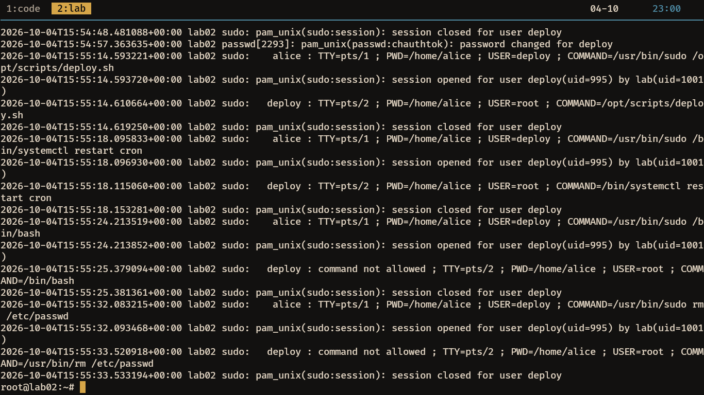

*auth.log showing an allowed COMMAND and a DENIED attempt*

### Questions (in report)

- Why use separate files in `/etc/sudoers.d/` instead of editing the main sudoers file? What is the risk of granting `NOPASSWD: ALL` to a service account?

Answer:

    - `/etc/sudoers.d/` keeps sudo rules **separate, organized, and easier to manage** without modifying the main sudoers file.

    - `NOPASSWD: ALL` gives a service account **passwordless access to any command as root**. If the account or CI system is compromised, an attacker can immediately gain **full root access**.

---
## Lab 7 - Incident response — compromised account containment

> usermod -L · pkill -u · gpasswd · last · auth.log — Medium

### Task 1 - **Immediate containment — lock the account:** run `usermod -L bob`. Verify the lock by inspecting `grep bob /etc/shadow` and finding the `!` prefix on the password hash.

```bash
usermod -L bob
grep bob /etc/shadow
```

Explain: I locked bob and see the `!` before the password hash of bob, that means this account has been locked

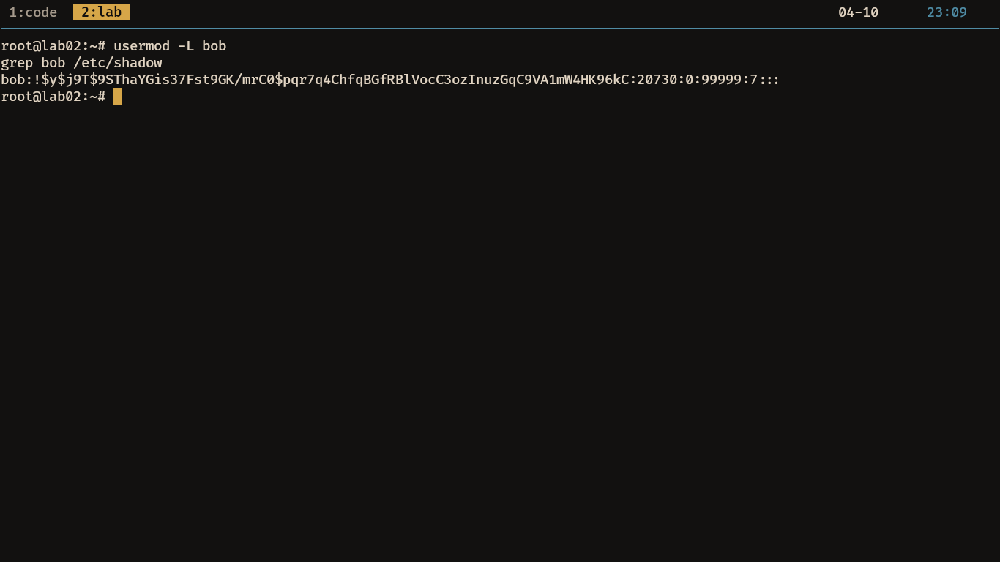

*/etc/shadow entry for bob showing the ! lock prefix*

### Task 2 - **Kill active sessions:** run `pkill -u bob` to terminate all of bob's running processes. Confirm with `who` and `ps aux | grep "^bob"` that no bob processes remain.

```bash
pkill -u bob
who
ps aux | grep "^bob"
```

Explain: No more bob

### Task 3 - **Revoke elevated access:** remove bob from the `sudo` and `docker` groups using `gpasswd -d bob sudo` and `gpasswd -d bob docker`. Confirm with `id bob`.

```bash
id bob                    # before containment
gpasswd -d bob sudo
gpasswd -d bob docker
id bob                    # after
```

Explain: `id bob` before the change showed `groups=1004(bob),27(sudo),1001(dev),986(docker)`,
which is the state the scenario describes — bob held `sudo` and `docker`. After the two
`gpasswd -d` commands only `1004(bob),1001(dev)` remain. `gpasswd -d` is the right tool here
because it edits one membership in `/etc/group`; `usermod -G` would have replaced the whole
supplementary list, which is the Lab 2 trap all over again.

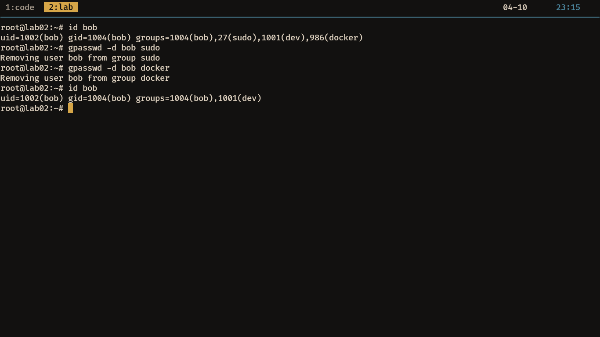

*id bob before containment (sudo + docker) and after*

### Task 4 - **Audit what bob did:** run `last bob` to see login history. Search `grep "bob" /var/log/auth.log` for sudo usage. Find files bob owns that were modified recently: `find /home/bob -newer /tmp/marker 2>/dev/null` (create `/tmp/marker` with `touch -d "1 hour ago" /tmp/marker`).

```bash
last bob
grep "bob" /var/log/auth.log

touch -d "1 hour ago" /tmp/marker
find /home/bob -newer /tmp/marker 2>/dev/null
```

Explain: These commands audit Bob's recent activity by checking login history, authentication/sudo logs, and recently modified files in Bob's home directory.

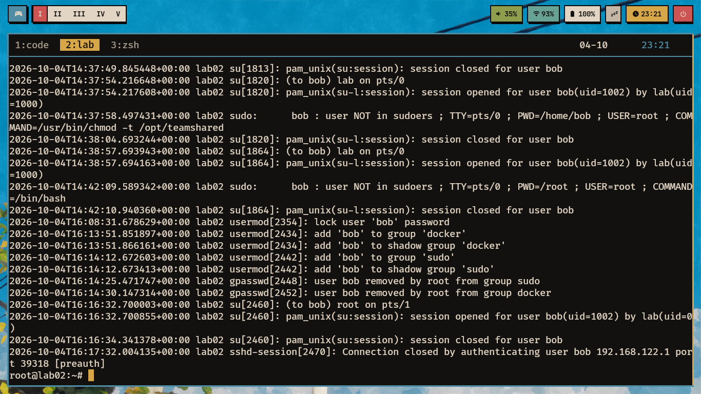

*last bob showing login history*

### Task 5 - **Recovery:** unlock the account (`usermod -U bob`), expire his password so he must reset it on next login (`passwd -e bob`), and restore only the `docker` group (not sudo — per the principle of least privilege).

```bash
usermod -U bob
passwd -e bob
usermod -aG docker bob
```

Explain: Unlocks Bob, forces a password reset, and restores only the required `docker` group while keeping `sudo` removed.

### Questions (in report)

- Write a short incident timeline (5–8 sentences): what you did, in what order, and why. What would the worst-case impact have been if bob had `NOPASSWD: ALL` in sudoers?

Answer: First, I locked Bob's account to prevent further password-based access. Then, I terminated Bob's active processes and removed his `sudo` and `docker` group memberships to contain the compromise. Next, I checked `last`, `auth.log`, and recently modified files to investigate his activity. After the investigation, I unlocked the account and expired Bob's password so he must create a new one. Finally, I restored only the `docker` group and kept `sudo` removed following the principle of least privilege. If Bob had `NOPASSWD: ALL`, an attacker who compromised his account could immediately execute any command as root, potentially taking complete control of the system.

---
## Lab 8 - Survive SSH disconnections with tmux

> tmux · sessions · windows · panes · detach/attach — Warm-up

### Task 1 - Create a named session: `tmux new -s dataproc`. Inside it, start a long job: `for i in $(seq 1 300); do echo "Step $i of 300"; sleep 1; done`.

```bash
tmux new -s dataproc
for i in $(seq 1 300); do echo "Step $i of 300"; sleep 1; done
```

Explain: Just follow the requirement

### Task 2 - Detach from the session (`Ctrl+B` then `D`) while the loop is running. Verify the session is still alive with `tmux ls`.

```bash
tmux ls
```

Explain: After detaching, the session is still alive

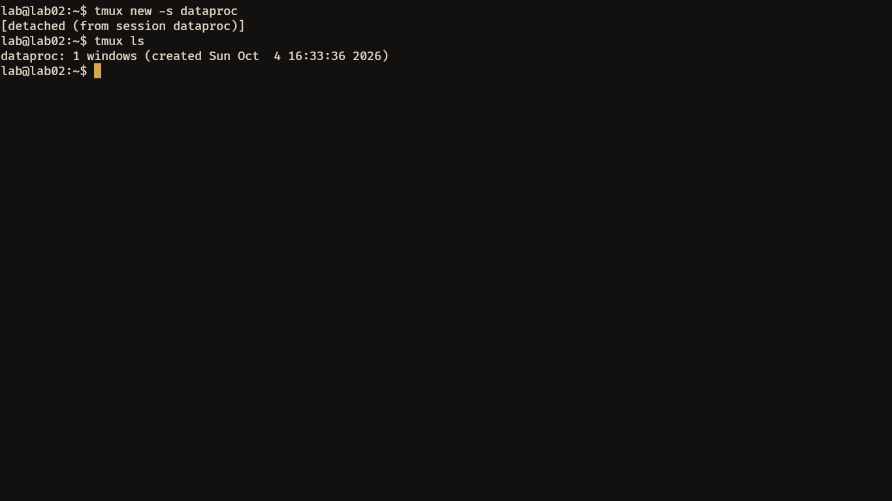

*tmux ls showing the session alive after detaching*

### Task 3 - Close your terminal window completely. Reopen a terminal and reattach: `tmux attach -t dataproc`. Confirm the counter is still incrementing where you left off.

```bash
exit
# (after reopen the terminal)
tmux attach -t dataproc
```

Explain: After closing, reopen the terminal and attach to tmux session again, the session is
still active — the counter was still incrementing from where it had stopped, and the shell
history was intact. Nothing was lost because the loop was never a child of the terminal I
closed; it was a child of the tmux server.

### Task 4 - Split the pane vertically (`Ctrl+B %`). In the right pane run `top`. Navigate between panes using `Ctrl+B ←→` arrows. Zoom into one pane with `Ctrl+B Z` and back.

```bash
# (after do the split)
top
```

Explain: Just split navigation

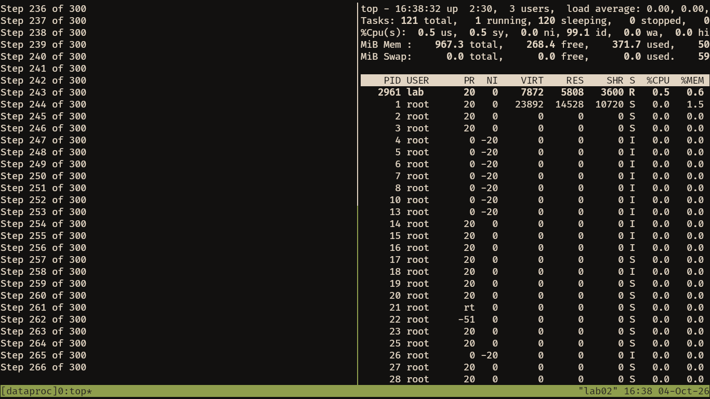

*the 2-pane view with the counter loop and top*

### Task 5 - Create a second window in the same session (`Ctrl+B C`). Rename it to `monitor` (`Ctrl+B ,`). Switch between windows with `Ctrl+B 0` / `Ctrl+B 1`. List all with `Ctrl+B W`.

```bash
# just do the keybind stuffs
```

Explain: Just do the keybind stuffs

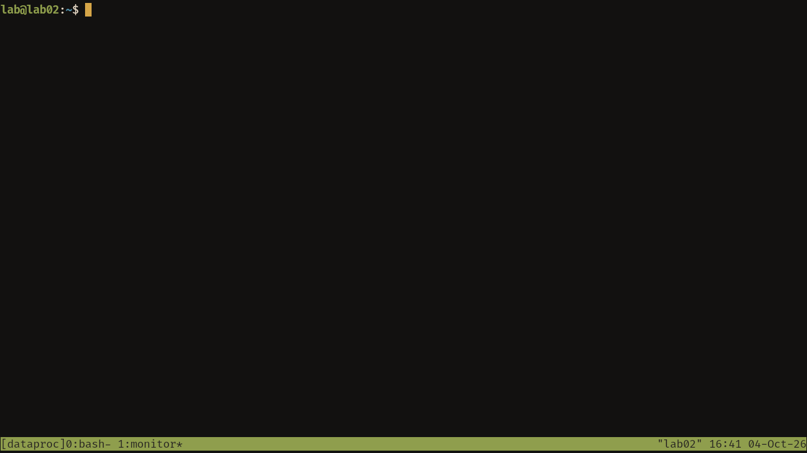

*the window list showing both windows, monitor renamed*

### Task 6 - Rename the entire session to `lab08` using `tmux rename-session lab08`. Verify with `tmux ls`.

```bash
tmux rename-session lab08
tmux ls
```

Explain: renamed the whole session

### Questions (in report)

- Describe one real scenario from your own work or studies where tmux would have prevented losing work. Explain in your own words what "detach" means at the OS level — why does the session survive?

Answer: When I'm writing code, exploring, compiling, or running multiple services at the same time, I can use a separate tmux session for each project, with multiple windows for different tasks. I can detach from one project and quickly switch to another without closing the first project's processes or work. At the OS level, `detach` means my terminal is no longer connected to the tmux session's pseudo-terminal (PTY), but the `tmux` server process and its child processes continue running in the background. When I attach again, tmux reconnects my terminal to the existing PTYs, allowing me to continue where I left off.

---
## Lab 9 - Diagnose and tame a runaway process

> ps · top · kill · nice · renice · signals · jobs — Medium

### Task 1 - Start a CPU hog in the background: `python3 -c "while True: pass" &`. Note the PID printed by the shell. Confirm it is consuming CPU via `top` (press `P` to sort by CPU usage).

```bash
python3 -c "while True: pass" &
top # PID 3336
```

Explain: The process with PID 3336 is eating my CPU.

### Task 2 - Inspect the process: `ps -p <PID> -o pid,comm,user,pcpu,pmem,nice,etime`. Record the NI (nice) value and how long it has been running.

```bash
ps -p 3336 -o pid,comm,user,pcpu,pmem,nice,etime

# output
PID COMMAND         USER     %CPU %MEM  NI     ELAPSED
3336 python3         root     99.5  0.8   0       02:04
```

Explain: Nice value is 0.

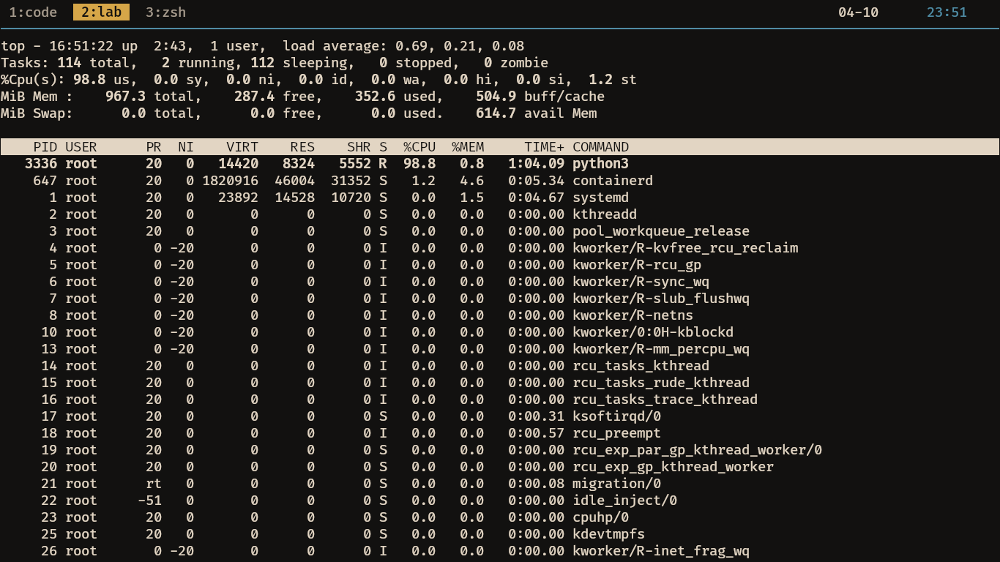

*top showing python3 near 100% CPU before renicing (NI = 0)*

### Task 3 - **Deprioritize (keep it running):** lower its priority with `renice -n 19 -p <PID>`. Watch the `NI` column in `top` change. Does other terminal activity feel more responsive now?

```bash
renice -n 19 -p 3336

# output
3336: old priority 0, new priority 19
```

Explain: The NI changed to 19, the lowest possible priority, so the scheduler now gives the
hog CPU only when nothing else wants it. It was not actually necessary for responsiveness on
an idle box — with only one busy process the CPU is 100% busy either way, and the difference
only shows once there is a second process competing for the same core. What renice really
guarantees is that if the lab server is shared, my shell stops queueing behind the hog.

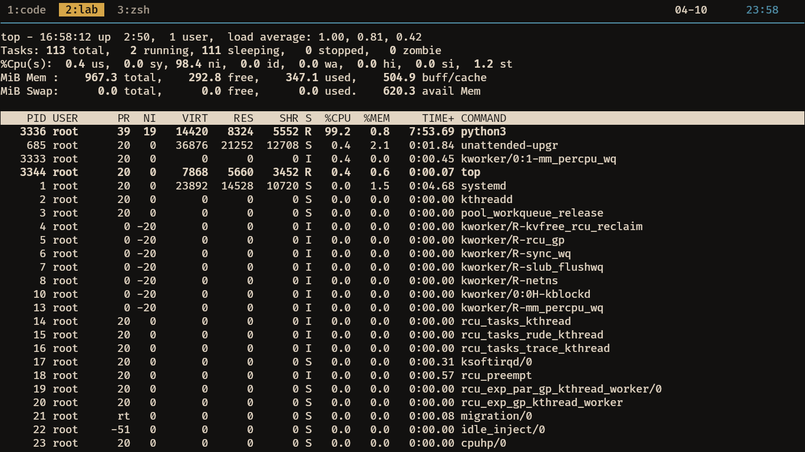

*top after renice -n 19, NI column changed to 19*

### Task 4 - **Signal escalation:** send SIGTERM (`kill <PID>`). Wait 3 seconds and check `ps -p <PID>`. Since a tight Python loop cannot catch SIGTERM, escalate to SIGKILL (`kill -9 <PID>`). Confirm it is gone.

```bash
kill 3336
sleep 3
ps -p 3336
# PID TTY          TIME CMD
# [1]+  Terminated              python3 -c "while True: pass"
```

The `ps` header with no row underneath means the process is gone, so the `kill -9` escalation
was not needed here and I did not run it.

Explain: `kill 3336` sends SIGTERM (15), requesting the process to terminate gracefully. The Python process terminated immediately, so SIGKILL (`kill -9`) was not necessary in this case. SIGKILL should only be used as a last resort when a process does not respond to SIGTERM.

### Task 5 - Start a new background job: `sleep 999 &`. Practice the full job-control cycle: check with `jobs`, bring to foreground (`fg %1`), suspend with `Ctrl+Z`, send to background (`bg %1`), then kill by job number (`kill %1`).

```bash
sleep 999 &
jobs
fg %1
# (after ctrl z)
bg %1
kill %1
```

Explain: just do the requirement.

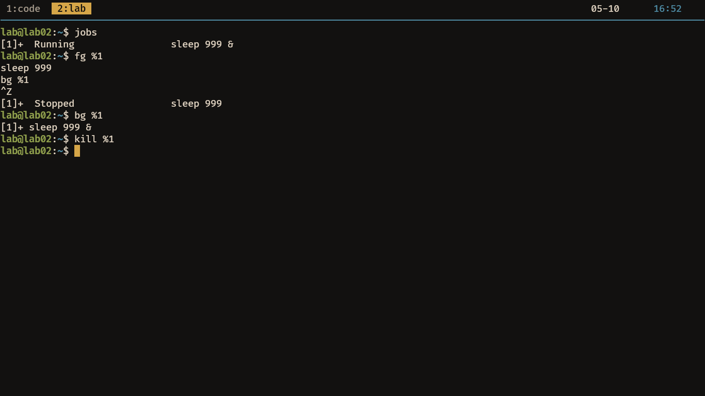

*the jobs listing and the bg/fg/kill cycle for sleep 999*

### Task 6 - **Stretch:** launch a new hog with `nice -n 10 python3 -c "while True: pass" &`. Compare its NI column in `top` to a default process. Confirm only root can set a negative nice value by trying `renice -n -5 -p <PID>` as a regular user.

```bash
nice -n 10 python3 -c "while True: pass" & # 1409
# now in top it has NI = 10

# drop root first, otherwise the negative nice would simply succeed
su - alice
renice -n -5 -p 1409
# renice: failed to set priority for 1409 (process ID): Permission denied
```

Explain: I started the process with a nice value of `10`, giving it lower CPU scheduling priority than a default process (`NI = 0`). I then tried to change its nice value to `-5`, which would increase its priority, but the operation was denied because a regular user does not have the privilege to set a negative nice value.

### Questions (in report)

- Explain SIGTERM, SIGKILL, SIGSTOP, SIGHUP, and SIGCONT — what each does and when you would use it. Why is `kill -9` always the last resort?

Answer:
- **SIGTERM:** Politely asks a process to terminate, giving it a chance to clean up resources and save data.
- **SIGKILL:** Immediately and forcibly terminates a process. The process cannot catch or handle this signal.
- **SIGSTOP:** Suspends a process without terminating it. It is similar to pressing `Ctrl+Z` in shell job control.
- **SIGHUP:** Traditionally sent when a controlling terminal or connection is closed. It is also commonly used by programs to reload their configuration.
- **SIGCONT:** Resumes a process that was stopped by `SIGSTOP` or another stop signal.

`kill -9` should be the last resort because `SIGKILL` does not allow the process to clean up or save its state. For example, abruptly killing a process while it is writing data may cause data loss or inconsistent state.

---
## Lab 10 - Harden a multi-role development server from scratch

> Capstone · all concepts — Spicy

### Task 1 - **Users & Groups:** Create groups `devs`, `ops`, `auditors`. Create: `alice` (devs), `carol` (ops), `eve` (auditors), and `cirunner` as a system user with `nologin` shell added to `devs`.

```bash
groupadd devs
groupadd ops
groupadd auditors

useradd -m -s /bin/bash -c "Dev user" -G devs alice
useradd -m -s /bin/bash -c "Ops User" -G ops carol
useradd -m -s /bin/bash -c "Auditor user" -G auditors eve
useradd -r -s /usr/sbin/nologin -c "System user" -G devs cirunner
```

Explain: Created users and groups according to requirements. The `-r` on `cirunner` is the
important flag: it makes it a *system* account, so it draws a UID from the reserved sub-1000
range instead of the regular user range, exactly like `svcapp` in Lab 1. `-G devs` still adds it
as a supplementary member of `devs`; the system-user flag does not change group membership.
Without `-r` the account would have been a normal login-capable user holding a UID above 1000,
which is the opposite of what a CI job account should be.

Explain: Created users and groups according to requirements.

### Task 2 - **Project directory:** Create `/opt/appdata` owned by `root:devs`, mode `2770` (SGID + full group access, no world access). Apply ACL: ops → r-x, auditors → r--. Set default ACL so all new files inherit.

```bash
sudo mkdir -p /opt/appdata
sudo chown root:devs /opt/appdata
sudo chmod 2770 /opt/appdata

# ACL on the directory itself
sudo setfacl -m g:ops:r-x,g:auditors:r-- /opt/appdata

# Default ACL for newly created objects
sudo setfacl -d -m g:ops:r-x,g:auditors:r-- /opt/appdata

getfacl /opt/appdata
```

Explain: The `2` in `2770` is the SGID bit, so every new file lands in group `devs` no matter
which member of `devs` created it, and the trailing `0` keeps `others` at no permissions at all.
`getfacl` then shows `group:ops:r-x` and `group:auditors:r--` layered on top. Note what
`r--` on a directory actually buys an auditor: they can `ls` the directory and read the names
inside it, but without the `x` bit they cannot descend into it or open a file by name. For a
genuinely read-only auditor role `r-x` is the correct grant; the slide specifies `r--`, so that
is what I applied, and the summary table in Task 7 records the distinction.

### Task 3 - **Log directory:** Create `/var/log/applog/` owned by `root:ops`, mode `750`. Grant `devs` write access and `auditors` read-only via ACL. Set default ACL. Confirm that cirunner (in devs) can write a log entry.

```bash
sudo mkdir -p /var/log/applog
sudo chown root:ops /var/log/applog
sudo chmod 750 /var/log/applog

# Grant devs read/write/traverse access to the directory
sudo setfacl -m g:devs:rwx /var/log/applog

# Grant auditors read/traverse access
sudo setfacl -m g:auditors:r-x /var/log/applog

# Default ACL for new files/directories
sudo setfacl -d -m g:devs:rwx,g:auditors:r-x /var/log/applog

# confirm cirunner can write a log entry
# the redirect has to happen *inside* cirunner's own shell, otherwise root's
# shell would create the file and prove nothing about cirunner's access
sudo -u cirunner bash -c 'echo "This is from cirunner" > /var/log/applog/cirunner.txt'
ls -l /var/log/applog/cirunner.txt
cat /var/log/applog/cirunner.txt   # this is from ci runner
```

Explain: `sudo -u cirunner echo "…" > file` looks like it tests cirunner, but the `>` is
performed by the *invoking* shell, which is root — so the file would be created by root and
the test would pass no matter what cirunner's permissions were. Wrapping the redirect in
`bash -c` makes cirunner the process that actually calls `open(2)`, and then it only succeeds
because `group:devs:rwx` is in the ACL. Also worth noting: `/var/log/applog` has **no** SGID
bit, so a log file created here inherits the creator's own primary group, not `ops` — only
`/opt/appdata` guarantees the shared group.

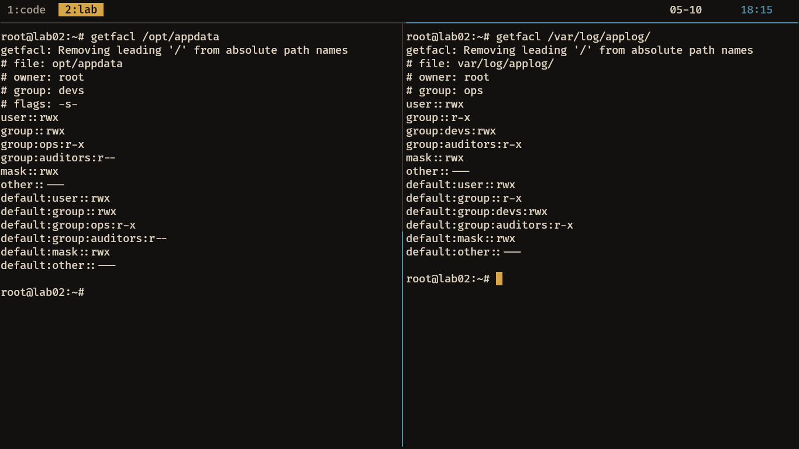

*getfacl /opt/appdata and /var/log/applog/ showing the full ACL setup*

### Task 4 - **Sudo policy:** Create `/opt/scripts/deploy.sh` (content: `echo "Deploy complete"`). In separate `sudoers.d` files: allow `devs` group to run `/opt/scripts/deploy.sh`, allow `ops` to run `/bin/systemctl status cron` (read-only check), allow `cirunner` NOPASSWD for `/opt/scripts/deploy.sh`. Auditors get no sudo at all.

```bash
mkdir -p /opt/scripts/
echo 'echo "Deploy complete"' > /opt/scripts/deploy.sh
chown root:dev /opt/scripts/deploy.sh
chmod 750 /opt/scripts/deploy.sh
ls -l /etc/sudoers.d/          # sudoers.d files must not be group/other writable

visudo -f /etc/sudoers.d/devs
visudo -f /etc/sudoers.d/ops
visudo -f /etc/sudoers.d/cirunner
```

```bash
# /etc/sudoers.d/devs
%devs ALL=(root) /opt/scripts/deploy.sh

# /etc/sudoers.d/ops
%ops ALL=(root) /bin/systemctl status cron

# /etc/sudoers.d/cirunner
cirunner ALL=(root) NOPASSWD: /opt/scripts/deploy.sh
```

Explain: Each role gets its own file so a later change to one rule cannot disturb the others,
and sudo only reads `/etc/sudoers.d/*` when those files are not group- or world-writable —
`visudo` creates them with mode `0440`, which is why the rule is never edited by hand.
`chmod 750 root:dev` on the script is deliberate: sudo checks execute permission against the
*invoking* user, so `%devs` members need the `x` bit, and `750` gives it to them via the group
without handing the deploy script to every other account on the box. No `sudoers.d` file is
created for `auditors`, so that role has no sudo entry at all.

### Task 5 - **Verify access:** as alice — write a file to `/opt/appdata` (should succeed). As carol — try to write to `/opt/appdata` (should fail). As eve — try to write anywhere (should fail everywhere). Confirm carol can read. Confirm eve can read.

```bash
su alice
echo "alice wrote it" > /opt/appdata/alice.txt # ok
su carol
echo "carol wrote it" > /opt/appdata/carol.txt # bash: /opt/appdata/carol.txt: Permission denied
ls -al /opt/appdata/ # ok

su eve
ls -al /opt/appdata/ # ok
echo "eve wrote it" > /opt/appdata/eve.txt # bash: /opt/appdata/eve.txt: Permission denied
```

Explain: Alice can write to `/opt/appdata/` because alice is in group `devs` and the group owner of that directory is `devs` which has permission to write. Carol cannot write to the directory because carol is in group `ops`, ACL only allow `ops` to read and execute. Eve cannot write because of the same reason as carol.

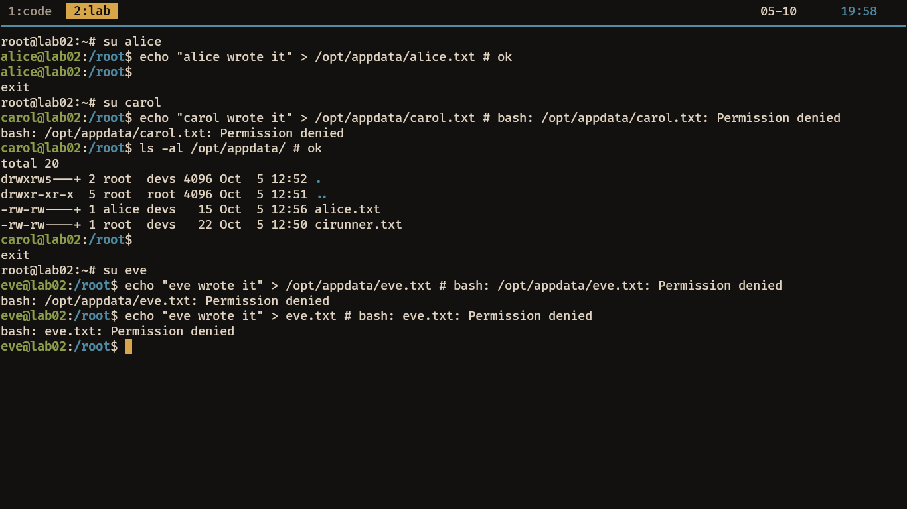

*access verification: alice writing, carol denied, eve denied*

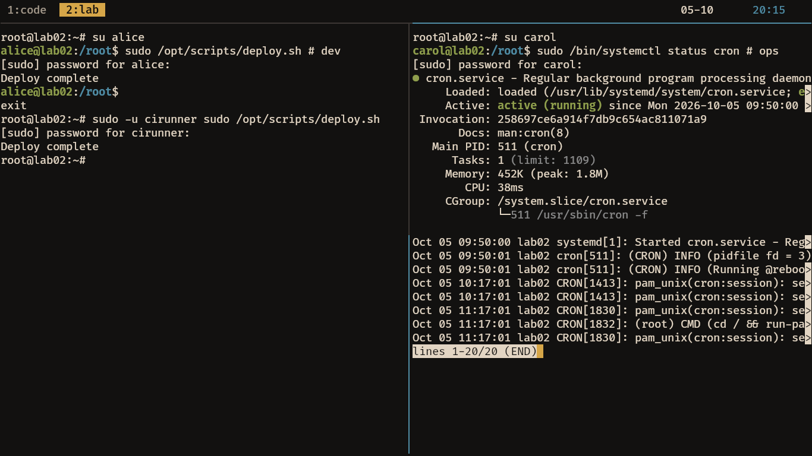

*sudo tests, allowed commands succeeding and disallowed rejected*

### Task 6 - **Security audit:** run the three checks from the slide: (a) find any UID=0 accounts besides root with `awk -F: '$3==0' /etc/passwd`, (b) find world-writable files in `/opt`, (c) find all SUID binaries you created. Confirm none are unexpected.

```bash
awk -F: '$3==0' /etc/passwd
find /opt -type f -perm -o+w
find / -type f -ls 2>/dev/null |
awk '{
    p = substr($3, 4, 1)
    if (p == "s" || p == "S")
        print
}'
```

Explain: The security audit checks confirmed that the system is configured as expected.

- `awk -F: '$3==0' /etc/passwd` returned only `root:x:0:0:root:/root:/bin/bash`, so there is
  no second UID 0 account — the classic backdoor check.
- `find /opt -type f -perm -o+w` returned nothing, so nothing under `/opt` is world-writable.
  Note this is `-type f`, so it deliberately skips directories; a world-writable directory
  would be the more dangerous finding and `find /opt -perm -o+w -type d` would surface it.
- The SUID scan listed only stock distribution binaries (`sudo`, `su`, `passwd`, `mount`,
  `umount`, `gpasswd`, `chsh`, `chfn`, `newgrp`, `dbus-daemon-launch-helper`, …).

Importantly, `/tmp/whotest.sh` from Lab 4 — the root-owned `4755` script I created — does **not**
appear in that list, because I deleted it after the SUID test. That is the right outcome: a
setuid file sitting in `/tmp` is writable-adjacent world-readable and is exactly the kind of
thing this audit is meant to catch, and it should not survive the lab that created it.

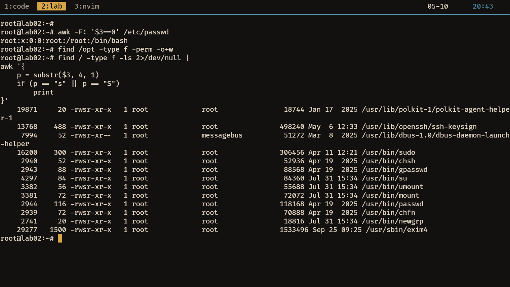

*security audit results, UID=0, world-writable and SUID checks*

### Task 7 - **Write-up:** document your design in 8–12 sentences. Include a summary table with columns: User | Groups | /opt/appdata | /var/log/applog | sudo rights.

**Write-up:** The server uses the `devs`, `ops`, and `auditors` groups to separate users based on their roles. Alice is a developer and belongs to the `devs` group, while Carol belongs to `ops` and Eve belongs to `auditors`. The `/opt/appdata` directory is owned by `root:devs` with mode `2770`, providing full access to developers while preventing world access, and its SGID bit means new files always land in group `devs` regardless of which developer created them. ACLs allow the `ops` group `r-x` on `/opt/appdata` and `auditors` only `r--`, which grants listing but not traversal. The `/var/log/applog` directory is owned by `root:ops` with mode `750`, and ACLs allow `devs` to write logs and `auditors` to read them; unlike `/opt/appdata` this directory has no SGID bit, so a log file inherits its creator's primary group rather than `ops`. Sudo access is restricted so that `devs` can run the deployment script, `ops` can check the status of the cron service, and `cirunner` can run the deployment script without a password. Auditors are not given any sudo privileges because their role only requires read-only access. The `cirunner` account is a system user with a `nologin` shell because it is intended for automated tasks rather than interactive human login. Using `nologin` reduces the risk of the service account being used for interactive access while still allowing it to perform its required tasks.

**Summary table:**

| User | Groups | /opt/appdata | /var/log/applog | sudo rights |
|---|---|---|---|---|
| **alice** | `devs` (plus `dev`, `docker`, `qa`, `sudo` from Lab 2) | Read/write/create | Read/write/create | Run `/opt/scripts/deploy.sh` |
| **carol** | `ops` | Read/traverse | Read/write/create | Run `/bin/systemctl status cron` |
| **eve** | `auditors` | List only (`r--`, cannot traverse) | Read + traverse (`r-x`) | None |
| **cirunner** | `devs` (system user, `nologin`) | Read/write/create | Read/write/create | `NOPASSWD` for `/opt/scripts/deploy.sh` |

### Questions (in report)

- Your 8–12 sentence design write-up, including the permission summary table. Justify why cirunner must be a system user with `nologin` and not a regular user account.

**Answer:** The server is designed using separate groups to enforce role-based access control. Developers receive write access to the project and log directories, while operations users have the permissions required to manage and inspect system services. Auditors receive read-only access and no sudo privileges, reducing the risk of unauthorized changes. The `cirunner` account is a system user because it is intended for automated tasks rather than a human user. Its `nologin` shell prevents interactive login through a normal shell. This reduces the attack surface if the account credentials are compromised. At the same time, `cirunner` can still run the specifically authorized commands through sudo. The account is also restricted to the `devs` group so it can perform its required logging tasks. This design follows the principle of least privilege by giving each account only the access required for its role.

---
